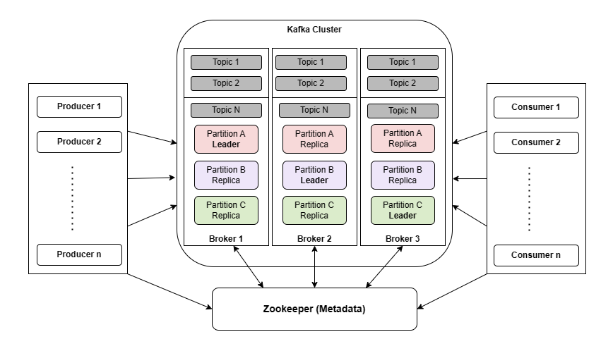

# **📡 Apache Kafka: The Backbone of Data Streaming**

    
    

## **📋 What is Apache Kafka?**

Apache Kafka is a **distributed event-streaming platform** designed to handle real-time data feeds. It’s used to collect, store, process, and distribute **large streams of data** in a fault-tolerant and scalable manner.

💡 **Key Idea:**  
Think of Kafka as a high-speed messaging system where producers send data (events) into the system, and consumers retrieve it in real time.

---

## **⚙️ Key Components of Apache Kafka**

### 1. **Producers:**

- **Definition:** Applications that publish (send) messages to Kafka topics.
- **Function:** Produce data and send it to topics. Producers are responsible for choosing which record to assign to which partition within a topic.
- **Example:** A web application producing log data to a "logs" topic.

### 2. **Topics:**

   

       
   

- **Definition:** Categories or feed names to which messages are published.
- **Function:** Organize and store records (messages). Think of a topic as a logical channel to which data is sent and from which data is read.
- **Example:** An e-commerce platform might have topics like "user_signups" and "purchase_orders."

### 3. **Partitions:**

    

    

- **Definition:** Sub-divisions of topics to allow parallel processing.
- **Function:** Allow Kafka to distribute data across multiple brokers, enabling load balancing and high throughput. Each partition is an ordered, immutable sequence of records.
- **Example:** The "purchase_orders" topic might be divided into several partitions based on order ID.

### 4. **Consumers:**

    

- **Definition:** Applications that read (consume) messages from Kafka topics.
- **Function:** Subscribe to topics and process the messages. Consumers can be part of a consumer group to distribute workload.
- **Example:** An analytics system that reads user activity data from a "user_activity" topic.

### 5. **Brokers:**

    

- **Definition:** Kafka servers that store and serve the messages.
- **Function:** Handle incoming data from producers, write data to disk, and serve data to consumers. Each broker can manage multiple topics.
- **Example:** A Kafka cluster might have multiple brokers to ensure high availability and fault tolerance.

#### 6. **ZooKeeper (Deprecated in newer versions):**

- Used to manage Kafka's distributed system by coordinating brokers.
- Newer versions of Kafka use **Kafka Raft (KRaft)** for this purpose.

**Summary:**

- **Topics:** Logical channels to which messages are published.
- **Producers:** Send messages to topics.
- **Consumers:** Read and process messages from topics.
- **Brokers:** Store and serve messages.
- **Partitions:** Sub-divisions of topics for parallel processing.
- **ZooKeeper:** Manages Kafka brokers and metadata.

---

## **🔄 How Apache Kafka Works**

### 1. **Data Ingestion:**

- Producers send messages (data) to a specific topic in Kafka.
- Example: A website sends user activity logs to a "user-activity" topic.

### 2. **Data Distribution:**

- Kafka stores messages in partitions across multiple brokers for fault tolerance and scalability.

### 3. **Data Retrieval:**

- Consumers subscribe to topics, retrieve messages, and process them.

### 4. **Retention:**

- Kafka retains messages for a configurable period, even after they are consumed, allowing replay and reprocessing.

---

## **🌟 Key Features of Apache Kafka**

1. **High Throughput:**

   - Kafka can handle millions of messages per second.

2. **Scalability:**

   - Add more brokers to the cluster to handle increasing workloads.

3. **Durability:**

   - Messages are replicated across brokers to ensure no data is lost.

4. **Fault Tolerance:**

   - If a broker fails, another broker can take over its tasks.

5. **Replayability:**

   - Consumers can replay messages by reading from a specific point in the log.

6. **Decoupling:**
   - Producers and consumers are independent, allowing flexibility in designing systems.

---

## **📊 Use Cases for Apache Kafka**

1. **Real-Time Analytics:**

   - Streaming website click data to analyze user behavior.

2. **Event-Driven Architectures:**

   - Sending notifications or triggering workflows based on user actions.

3. **IoT Data Processing:**

   - Collecting and analyzing data from sensors in real time.

4. **Data Integration:**

   - Transferring data between databases, data lakes, and data warehouses.

5. **Log Aggregation:**
   - Collecting logs from multiple applications for centralized monitoring.

---

## **⚡ Kafka vs. AWS Kinesis**

| **Feature**     | **Apache Kafka**                                    | **AWS Kinesis**                                        |
| --------------- | --------------------------------------------------- | ------------------------------------------------------ |
| **Management**  | Self-managed (requires setup and maintenance).      | Fully managed by AWS.                                  |
| **Scalability** | Scale by adding brokers and partitions.             | Automatically scales with AWS infrastructure.          |
| **Latency**     | Low latency (optimized for real-time data).         | Slightly higher latency due to managed nature.         |
| **Pricing**     | Free (open-source), but infrastructure costs apply. | Pay-as-you-go (AWS charges per shard and data volume). |
| **Ease of Use** | Requires expertise to set up and manage.            | Simple to use with AWS console or CLI.                 |

💡 **Note:** While AWS doesn’t explicitly state it, Kinesis shares architectural similarities with Kafka and likely draws inspiration from it.

---

## **🔍 Kafka Architecture in Detail**

1. **Producers:**

   - Producers push messages to Kafka topics.
   - Example: An e-commerce app sends order details to a "orders" topic.

2. **Topics and Partitions:**

   - Each topic is split into partitions.
   - Messages within a partition are stored in the order they arrive.

3. **Brokers and Clusters:**

   - A cluster is made up of multiple brokers.
   - Messages are distributed across brokers for high availability.

4. **Consumers:**

   - Consumers subscribe to topics and pull messages.
   - Kafka ensures each consumer gets only the messages they haven’t yet read.

5. **Replication:**
   - Kafka replicates data across brokers to ensure durability.
   - **Leader Partition:** Handles reads/writes.
   - **Replica Partition:** Acts as a backup.

---

## **🌍 Real-Life Example: How Kafka Works**

**Scenario:**  
A ride-sharing app processes real-time trip data from millions of drivers and passengers.

1. **Producers:**

   - Each driver’s app sends GPS coordinates to a "trip-data" topic.

2. **Kafka Cluster:**

   - Messages are distributed across brokers and partitions for scalability.

3. **Consumers:**
   - A real-time analytics system consumes trip data to show available rides on user maps.
   - A separate consumer stores the data in a database for reporting.

**Result:**  
Kafka enables real-time matching of drivers and passengers while archiving trip data for future analysis.

---

## **🧠 Simple Analogy**

Think of Kafka as a **real-time post office**:

1. **Producers (Senders):** Send letters (messages) to specific mailboxes (topics).
2. **Kafka (Post Office):** Stores and distributes letters to the correct mailboxes.
3. **Consumers (Receivers):** Pick up their letters (messages) from the assigned mailbox.

---

## **🌟 Benefits of Using Kafka**

1. **Real-Time Data Processing:**

   - Perfect for time-sensitive applications like fraud detection or IoT.

2. **Reliability:**

   - Data is replicated across brokers to prevent loss.

3. **Decoupling Systems:**

   - Producers and consumers can operate independently.

4. **Scalability:**
   - Easily scale with growing workloads by adding brokers and partitions.

---

## **📊 Popular Use Cases for Kafka**

1. **Netflix:** Streams logs and events for monitoring and analytics.
2. **LinkedIn:** Tracks user interactions to deliver recommendations.
3. **Uber:** Streams trip data for real-time ride matching and pricing.

---

## **🌍 Kafka in AWS**

While AWS Kinesis provides similar functionality, **Amazon MSK (Managed Streaming for Apache Kafka)** offers a fully managed Kafka service. It takes away the complexity of setup and maintenance, making it easier to deploy Kafka workloads on AWS.

## Advanced Topics for Kafka

### 1. Replication

Replication in Kafka ensures that data is copied across multiple brokers for fault tolerance and high availability. This way, if one broker fails, another can take over.

    

### 2. Limitations

1. **Repartitioning:**
   - Repartitioning can be difficult and may lead to issues with offsets.
2. **Head-of-Line Blocking:**
   - Single partition consumers can suffer from head-of-line blocking if a message takes too long to process.

### 3. Kafka Configuration

- **Exactly-once Semantics:**
  - Achieving exactly-once processing can be tricky.
- **Retries and Acknowledgements:**
  - Configuring retries, acknowledgements, and other parameters to ensure reliable message delivery.

### 4. Streaming

Kafka Streams is a client library for building real-time, stream processing applications on top of Kafka. It allows you to process and transform data as it arrives in real-time.

### 5. Dead-letter Queues

Dead-letter queues (DLQs) are used to handle messages that cannot be processed successfully. They allow you to store problematic messages separately for further inspection and resolution.

### 6. Monitoring

Monitoring Kafka clusters is crucial for ensuring reliability and performance. Common tools and metrics include:

- **JMX Metrics:** For monitoring broker performance.
- **Kafka Manager:** For managing and monitoring clusters.
- **Prometheus and Grafana:** For visualization and alerting.
