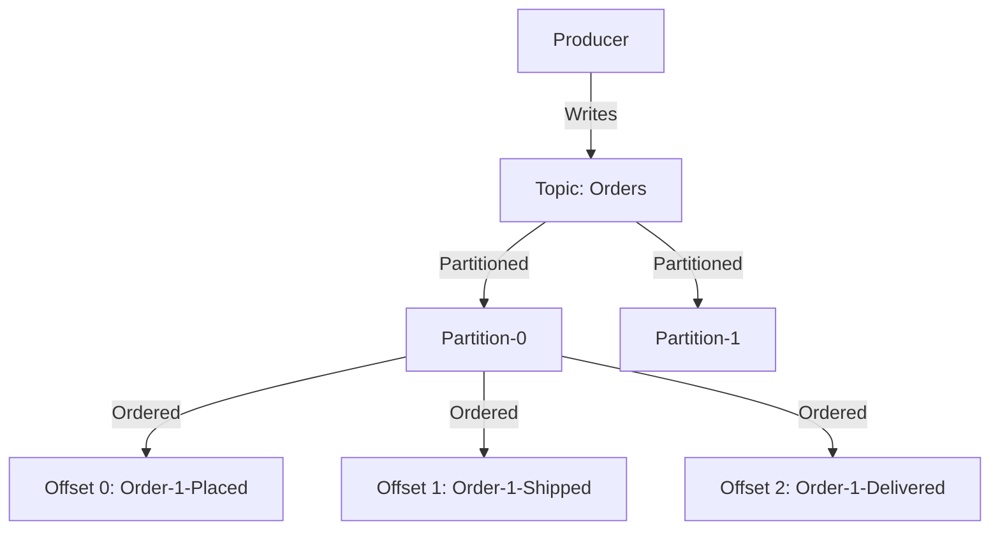
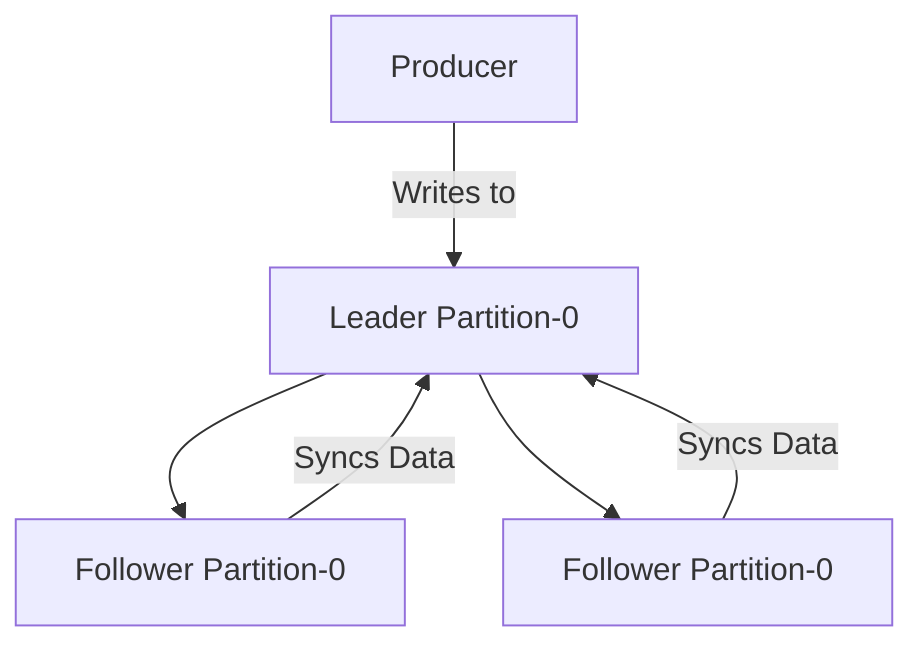
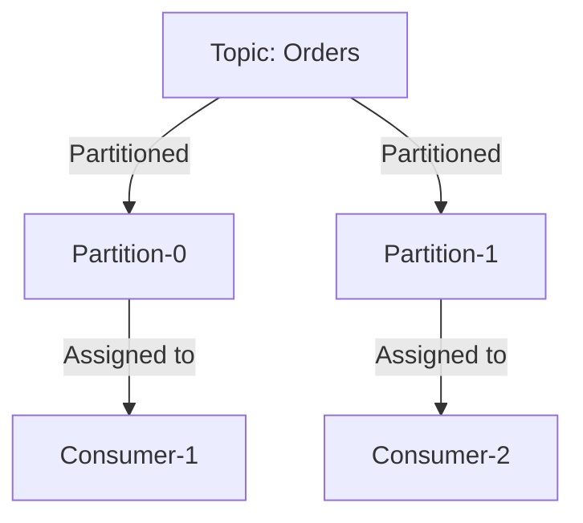
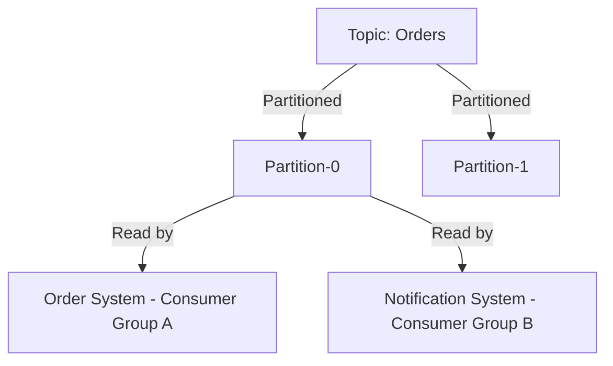

# 🎯 **Kafka Internals: How the Magic Happens Behind the Scenes**

Apache Kafka is a **high-performance distributed event streaming platform** used for **real-time data pipelines** and **event-driven architectures**.  
But have you ever wondered **what happens inside Kafka?** 🤯

This deep dive into **Kafka’s internals** will uncover how Kafka handles **message storage, offset tracking, partitioning, replication, leader elections, and more!** 🚀

---

## 🔥 **1. Kafka Architecture Overview**

At its core, Kafka consists of **five key components**:

| 🏗️ **Component**  | 📌 **What It Does**                                            |
| ----------------- | -------------------------------------------------------------- |
| **Producers** 🏭  | Send messages (events) to Kafka topics.                        |
| **Brokers** 📦    | Store messages and distribute them to consumers.               |
| **Topics** 📑     | Logical categories where events are written.                   |
| **Partitions** 📂 | Subdivisions of a topic, enabling parallelism and scalability. |
| **Consumers** 🏠  | Read messages from Kafka topics.                               |

---

## ⚖ **2. Kafka's Storage Model: Logs, Offsets & Segments**

Kafka is essentially a **log-based message broker** that stores events in an **immutable append-only log**. Let’s break it down:

### 📂 **2.1. Topics & Partitions: How Data is Stored**

- Each **Topic** is divided into **Partitions** (like folders).
- Messages inside a **Partition** are **strictly ordered**.
- A **Partition is stored as a Log file** on disk.

---

### 📌 **2.2. Offset Tracking: Who Keeps Track?**

Kafka assigns each record a **unique offset** (its position in the log).  
👉 **BUT! Kafka itself does NOT move offsets!** **Consumers** are responsible for **committing offsets** to keep track of what they have read.

| 🛠️ **Offset Management Mode** | 🔍 **How It Works**                                                              |
| ----------------------------- | -------------------------------------------------------------------------------- |
| **Automatic** (default)       | Consumer commits offset **automatically** after processing a batch of messages.  |
| **Manual**                    | Consumer commits offset **explicitly** when it finishes processing each message. |

---

### ⚠ **2.3. Consumer Offsets: What If a Consumer Fails?**

1️⃣ **Kafka stores committed offsets in an internal topic (`__consumer_offsets`).**  
2️⃣ If a consumer **crashes and restarts**, it will **resume from the last committed offset**.  
3️⃣ If offsets are **not committed**, the consumer **may reprocess old messages or lose new ones**.

---

## 🔁 **3. Kafka Replication: Ensuring Durability & Availability**

Kafka **replicates partitions across multiple brokers** to prevent **data loss**.

### 🔹 **3.1. Leader & Followers: How Data is Replicated**

- Each partition has a **Leader** (primary storage & reads/writes).
- Other brokers act as **Followers**, replicating data.
- If a **Leader fails**, a **Follower is elected as the new Leader**.

---

### 🛑 **3.2. What Happens If a Broker Fails?**

1️⃣ Kafka automatically detects failure via **ZooKeeper**.  
2️⃣ A **new leader** is elected from in-sync replicas (ISR).  
3️⃣ Producers and Consumers **reroute to the new leader** **without downtime**.

---

## 🏎️ **4. Kafka’s High-Throughput Magic: Batching & Compression**

Kafka is **blazing fast** because of two main techniques:

| 🔥 **Optimization** | ⚙️ **How It Helps**                                                    |
| ------------------- | ---------------------------------------------------------------------- |
| **Batching** 🚀     | Groups multiple messages into **a single request**, reducing overhead. |
| **Compression** 📉  | Uses **Snappy, LZ4, Gzip** to reduce network & disk usage.             |

---

## 🎯 **5. Kafka Consumer Groups: Scaling Out**

Kafka **scales consumers horizontally** via **Consumer Groups**.

- Each consumer **reads from a unique partition**.
- If you **add more consumers**, Kafka **reassigns partitions dynamically**.

---

## ❌ **6. Worst-Case Scenarios & How Kafka Handles Them**

### ⚠ **Scenario 1: Consumer Fails Midway**

❌ **Issue:** A consumer crashes before committing offsets.  
✅ **Solution:** Kafka assigns the partition to another consumer, which **resumes from the last committed offset**.

---

### ⚠ **Scenario 2: Multiple Consumers in a Group Read the Same Partition**

❌ **Issue:** If two consumers in the same group read **the same partition**, **only one** gets assigned the partition.  
✅ **Solution:** Kafka ensures **only one consumer per partition per group**.

---

### ⚠ **Scenario 3: Notification System & Order System Need the Same Data**

❌ **Issue:**

- **Order System** processes `order-1-placed → shipped → delivered`.
- **Notification System** must also process all these events but is in a different application.

✅ **Solution:**

- **Use separate Consumer Groups!** Kafka **tracks offsets per group**, ensuring each system processes **ALL records**.

---

## 🚀 **7. Why Kafka is Built for Scalability**

| 🚀 **Feature**      | 🏆 **How Kafka Scales**                                                        |
| ------------------- | ------------------------------------------------------------------------------ |
| **Partitions**      | Kafka distributes partitions **across brokers** to parallelize writes & reads. |
| **Consumer Groups** | Kafka dynamically **balances workload** across consumers.                      |
| **Replication**     | Kafka ensures **data durability** even if brokers fail.                        |

---

## 🎯 **8. Kafka vs. Other Streaming Systems**

| ⚔ **Feature**         | **Kafka (MSK) 🎯**                       | **Kinesis (KDS) 🌊**                       |
| --------------------- | ---------------------------------------- | ------------------------------------------ |
| **Offset Tracking**   | **Kafka manages offsets** automatically. | Consumers **must track offsets manually**. |
| **Message Replay**    | Consumers **can rewind** to any offset.  | Consumers must **specify timestamps**.     |
| **Partition Scaling** | **Dynamically adjustable.**              | **Fixed number of shards.**                |
| **Latency**           | **Ultra-low latency** (5ms).             | ~200ms latency in shared throughput.       |

---

## 🏁 **Final Takeaways: Why Kafka is Awesome**

✅ **Kafka stores and manages offsets for you**  
✅ **Kafka scales partitions dynamically**  
✅ **Kafka provides fault tolerance via replication**  
✅ **Kafka ensures strict message ordering per partition**  
✅ **Kafka lets multiple consumer groups read the same data independently**

🚀 **Now that you know Kafka’s internals, you’re ready to build rock-solid streaming applications!**
