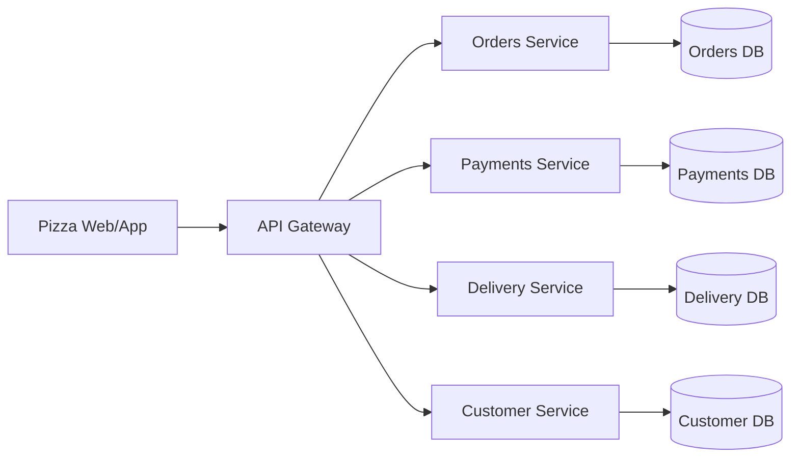

# 🧩 What Are Microservices?

---

## 🎯 Official Definition (No Boring Stuff)

Microservices are a **software architectural style** where an application is built as a **collection of small, autonomous services** that:

- Run **independently**
- Own their **own data**
- Communicate over **lightweight APIs** (REST, gRPC, or messaging)
- Are **independently deployable**

Think of it like building with LEGO 🧱: each block has a clear function, but together they make a castle.

---

## 🏰 Problem Scenario – The Pizza Company 🍕

Imagine you’re hired at **PizzaTown Inc.**, and they have an _old-school monolith_ for their online ordering system.

### The Monolith Setup

- **One codebase** handling:
  🍕 Orders
  👨‍💼 Customers
  💳 Payments
  📦 Delivery tracking
- **One database** (giant `PizzaDB`) with 200 tables.
- **One deployment** (drop everything in IIS/Azure App Service).

👉 Problem? If you just want to add “PayPal payments,” you must redeploy the **whole monolith**, test every single part, and risk breaking deliveries 🍕. Scaling is worse: when customers flood the system during _World Pizza Day_, you have to scale the **entire app**, not just Payments.

---

## 🔄 Enter Microservices

Instead of one monster app, you split by **business capability**:

- **Orders Service** → handles pizza orders.
- **Payments Service** → handles credit card, PayPal, ApplePay.
- **Delivery Service** → tracks the pizza rider.
- **Customer Service** → stores customer profiles.

Each service:

- Has its **own DB** (PaymentsDB, OrdersDB, etc).
- Deploys **independently** (bug fix in Payments ≠ redeploy Orders).
- Can **scale individually** (Payments can scale 10× on World Pizza Day; Delivery stays the same).

---

## ⚔️ Monolith vs Microservices (Exam Favorite)

| Feature        | Monolith 🏰     | Microservices 🧩      |
| -------------- | --------------- | --------------------- |
| Codebase       | Single big one  | Many small            |
| Database       | Shared DB       | Per service           |
| Deployment     | One artifact    | Independent           |
| Scaling        | All or nothing  | Per service           |
| Failure        | Domino effect   | Isolated (ideally)    |
| Team Ownership | Big shared team | Small, focused squads |

👉 **If you see a Q like:** _“Which approach gives team autonomy & independent deployments?”_ → **Microservices**.

---

## 🧭 Core Principles (easy mnemonic: **IDEAL**)

- **I – Independent deployability**
- **D – Decentralized data** (each service owns its schema)
- **E – Elastic scaling** (scale what’s hot)
- **A – API-based communication** (REST, gRPC, Messaging)
- **L – Loose coupling** (services don’t need each other’s guts)

---

## 🖼 Diagram – PizzaTown Microservices

---

## 🧠 Problem-Based Qs You Might See

1. **Q:** The app has grown so big that adding a payment method requires redeploying the whole system. Which architecture solves this?
   **A:** Microservices (independent deployment).

2. **Q:** In a microservices system, should all services share the same DB schema for consistency?
   **A:** No ❌ — each service owns its data.

3. **Q:** On Black Friday, only the Payment system is overloaded. What scaling approach works best?
   **A:** Microservices → scale Payments service only.

4. **Q:** Which architecture is easiest for small teams and early startups?
   **A:** Monolith (simple to start, less ops overhead).

---

## ⚠️ Pitfalls & Real-Life Tradeoffs

- Microservices aren’t free 🤑 — more moving parts, CI/CD pipelines, and monitoring needed.
- Great for **large, complex systems** with multiple teams.
- Overkill for a simple CRUD app with 2 devs (just use monolith until needed).

---

## ✅ Exam Takeaways (Sticky Notes)

- Microservices = **independently deployable, loosely coupled services with their own DBs**.
- Always contrast with **monolith** in terms of **scaling, failures, deployments, DB ownership**.
- Use microservices when system is **large, fast-moving, multi-team**.
- Don’t forget the **PizzaTown story** — exam scenarios often mimic this pattern.
