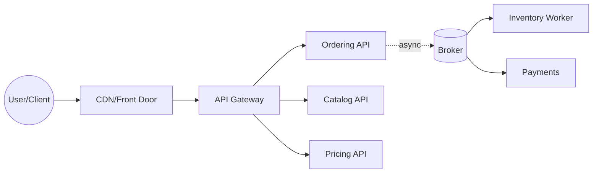
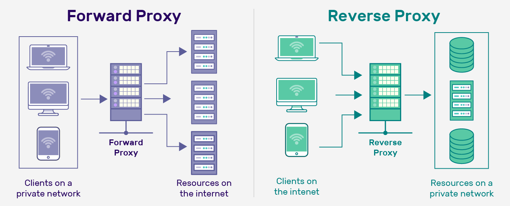

# 🚪 API Gateway — The One Front Door (routing, auth, throttling)

> Goal: put a **smart, thin front door** in front of your microservices to handle **edge concerns**—not business logic. Think: **routing, TLS, authn/z, rate limits, quotas, CORS, headers, caching, observability**, and **zero-trust enforcement**.

We’ll anchor on **MegaShop** and show **Azure API Management (APIM)** and **YARP** (ASP.NET Core Reverse Proxy) examples—perfect for .NET roles.

---

## 🧠 Mental Model

- **North–South traffic** (user/internet → platform) hits the **API Gateway** first.
- Gateway **terminates TLS**, **authenticates** the caller, **authorizes/limits** the call, **routes** to the right service, **adds correlation**, maybe **caches**, then **observes**.
- Internals (service↔service) don’t go through the gateway (that’s **East–West**: service mesh territory).



---



---

## 🧰 Core Jobs of a Gateway (keep it thin!)

1. **Routing & Composition (lightweight)**

   - Path/host-based routing (`/api/orders` → `orders.svc`)
   - Header-based routing (version, canary), request/response transformation
   - _Light composition_ (join 2–3 simple calls) — avoid business logic

2. **Security at the Edge**

   - **TLS termination**, **CORS**, **WAF** (if integrated)
   - **OAuth2/OIDC** validation (JWT), **API keys**, **mTLS** for B2B
   - Normalizes identity for downstream services (adds `sub`, `scope`, `roles` claims)

3. **Throttling, Quotas, & Protection**

   - **Rate limiting** (per consumer, per IP, per token)
   - Quotas/month for plans (free vs enterprise)
   - Spike arrest, request size limits, header scrubbing

4. **Observability**

   - **Correlation IDs**, access logs, metrics (RPS, P99, 4xx/5xx), tracing headers (`traceparent`)
   - Request/response sampling, audit logs

5. **Reliability & Traffic Control**

   - **Retries** on edge-safe cases, **circuit breaking** to unhealthy backends
   - Canary/blue-green via **weighted routes** or header flags
   - Caching for **GETs** (ETag/TTL) to cut latency/cost

> **Anti-pattern:** putting **business workflows** and cross-service orchestration in the gateway. That becomes a chokepoint and kills autonomy.

---

## 🏗️ Azure API Management (APIM) — Policies you’ll actually use

**Validate JWT (OIDC) + add correlation + rate limit:**

```xml
<policies>
  <inbound>
    <base />
    <validate-jwt header-name="Authorization" require-expiration-time="true" failed-validation-httpcode="401">
      <openid-config url="https://login.microsoftonline.com/{tenant}/v2.0/.well-known/openid-configuration" />
      <required-claims>
        <claim name="aud">
          <value>api://megashop-gateway</value>
        </claim>
      </required-claims>
    </validate-jwt>

    <set-header name="X-Correlation-Id" exists-action="override">
      <value>@(context.Request.Headers.GetValueOrDefault("X-Correlation-Id", Guid.NewGuid().ToString()))</value>
    </set-header>

    <rate-limit-by-key calls="100" renewal-period="60" counter-key="@(context.Principal?.GetClaim("sub") ?? context.Request.IpAddress)" />
    <set-backend-service base-url="https://orders.svc.cluster.local" />
    <rewrite-uri template="/api/orders{path}" />
  </inbound>

  <backend>
    <base />
  </backend>

  <outbound>
    <base />
    <set-header name="X-Correlation-Id" exists-action="override">
      <value>@(context.Request.Headers["X-Correlation-Id"])</value>
    </set-header>
  </outbound>
</policies>
```

**Response caching for GETs:**

```xml
<cache-lookup vary-by-developer="false" vary-by-developer-groups="false" downstream-caching-type="none" />
<!-- call backend -->
<cache-store duration="60" />
```

**Weighted canary:**

```xml
<choose>
  <when condition="@((new Random()).Next(100) < 10)">  <!-- ~10% -->
    <set-backend-service base-url="https://orders-v2.svc" />
  </when>
  <otherwise>
    <set-backend-service base-url="https://orders.svc" />
  </otherwise>
</choose>
```

---

## 🧪 YARP (Yet Another Reverse Proxy) — .NET-native edge proxy

Great for **in-cluster** or simple edge scenarios you control in code.

**`appsettings.json`**

```json
{
  "ReverseProxy": {
    "Routes": {
      "orders": { "ClusterId": "orders", "Match": { "Path": "/api/orders/{**catch-all}" } },
      "catalog": { "ClusterId": "catalog", "Match": { "Path": "/api/catalog/{**catch-all}" } }
    },
    "Clusters": {
      "orders": { "Destinations": { "d1": { "Address": "http://orders.default.svc.cluster.local/" } } },
      "catalog": { "Destinations": { "d1": { "Address": "http://catalog.default.svc.cluster.local/" } } }
    }
  }
}
```

**`Program.cs`**

```csharp
var builder = WebApplication.CreateBuilder(args);
builder.Services.AddReverseProxy().LoadFromConfig(builder.Configuration.GetSection("ReverseProxy"));
var app = builder.Build();

// Simple auth/ratelimit middleware can be plugged in here
app.Use(async (ctx, next) =>
{
    // Correlation
    var cid = ctx.Request.Headers["X-Correlation-Id"].FirstOrDefault() ?? Guid.NewGuid().ToString();
    ctx.Response.Headers["X-Correlation-Id"] = cid;
    await next();
});

app.MapReverseProxy();
app.Run();
```

> Need **advanced policies, developer portal, product plans, quotas**? Use **APIM**. Need a **programmable proxy** in .NET with K8s DNS discovery? **YARP** is perfect.

---

## 🧩 Gateway vs Mesh vs Ingress (know the differences)

| Thing                          | Purpose                                       | Traffic         | Typical Tech                                |
| ------------------------------ | --------------------------------------------- | --------------- | ------------------------------------------- |
| **API Gateway**                | Edge security, routing, quotas, products      | **North–South** | APIM, Kong, NGINX, Envoy Gateway, YARP      |
| **Ingress Controller**         | K8s entry point L7 routing                    | North–South     | NGINX Ingress, Contour, Istio Ingress       |
| **Service Mesh**               | mTLS, retries, telemetry **between services** | **East–West**   | Istio/Linkerd (sidecars), Open Service Mesh |
| **BFF (Backend For Frontend)** | UI-specific aggregation                       | Edge per-client | Small façade service per app                |

> Often you’ll have **Ingress → API Gateway → Services**; mesh is optional for internal S2S concerns.

---

## 🔐 Security Patterns (edge-first, zero-trust)

- **JWT validation at gateway** (issuer/audience, exp/nbf), short TTL tokens, optional **mTLS** for partner APIs.
- **Scopes/roles** mapped to backend permissions; pass **claims** as headers.
- **Header allow-list**; strip dangerous headers; cap header/body size.
- **WAF** (OWASP rules) in front (e.g., Azure Front Door WAF → APIM).

---

## 🚦 Throttling & Quotas (keep platforms healthy)

- **Rate limit** per IP/consumer/subscription; burst + sustained windows.
- **429 + Retry-After** on excess; clients should back off with jitter.
- **Quotas** per plan (e.g., 1M calls/month), **spike arrest** for sudden floods.

---

## ⚙️ Traffic Shaping & Releases

- **Weighted routing** for canaries; header/cookie-based sticky cohorts.
- **Blue/Green**: flip route weight 0→100 instantly with rollback.
- **Shadow traffic**: mirror a % of prod traffic to new backend in “observe-only” mode.

---

## 🪪 Versioning & Transformation

- **Path (`/v1`) or header (`Accept: application/vnd.mega.v1+json`)**.
- Gateways can **rewrite paths**, **remap fields**, or **hide** internal fields.
- Keep **backward compatible**; deprecate with telemetry and docs.

---

## 🕵️ Observability (edge is where it starts)

- **Access logs**: status, latency, upstream, user, route.
- **Metrics**: RPS, P95/P99, 4xx/5xx, cache hit ratio, throttle counts.
- **Tracing**: start trace at the gateway; **propagate `traceparent`** downstream.
- **Correlation**: generate or forward `X-Correlation-Id`.

---

## 🚨 Common Anti-Patterns (and quick fixes)

| Anti-Pattern                       | Pain                       | Fix                                                     |
| ---------------------------------- | -------------------------- | ------------------------------------------------------- |
| Gateway contains business logic    | Chokepoint, hard to evolve | Keep it **thin**; business stays in services            |
| Single “mega-gateway” for all orgs | Org-wide blast radius      | **Federate** into domains; use products/APIs per domain |
| No rate limits                     | Outages under spikes       | Add **per-consumer** limits & quotas                    |
| Exposing internals directly        | Leaky abstractions         | Stable **public contracts** at the edge                 |
| No caching for hot GETs            | Cost & latency             | Enable **TTL/ETag** caching at gateway                  |
| Missing JWT validation             | Security risk              | Validate issuer/audience/expiry at the edge             |

---

## 🧪 Likely Assessment Prompts (with crisp replies)

- **What does an API Gateway do?**
  _Auth (JWT/OAuth2), routing, TLS, rate limits/quotas, CORS, caching, transformations, observability._

- **Gateway vs Service Mesh?**
  _Gateway = edge (north–south). Mesh = internal S2S (east–west) with mTLS/retries/telemetry._

- **Why keep gateway thin?**
  _Avoid central bottleneck; maintain service autonomy; simpler deploys & scaling._

- **How to do canary releases?**
  _Weighted routes or header-based routing at the gateway; observe metrics, roll forward/back._

- **How to protect APIs from abuse?**
  _Rate limit + quotas, WAF, JWT validation, request size limits, spike arrest, 429 with `Retry-After`._

---

## ✅ Pocket Checklist

- [ ] TLS, CORS, WAF in front; JWT validated at edge
- [ ] Route by path/host; optional header-based version/canary
- [ ] Rate limits & quotas per consumer; meaningful 429s
- [ ] Generate/forward **Correlation ID**; emit traces/metrics
- [ ] Cache hot GETs; keep gateway **thin** (no business logic)
- [ ] Plan for failure: circuit breaking, timeouts, health checks
- [ ] Clear versioning strategy; transformations only for edge cleanliness

---

> **One-liner to remember:** _The API Gateway is your secure, observable front door—great at edge concerns, terrible at business logic. Keep it thin and let services do the real work._
