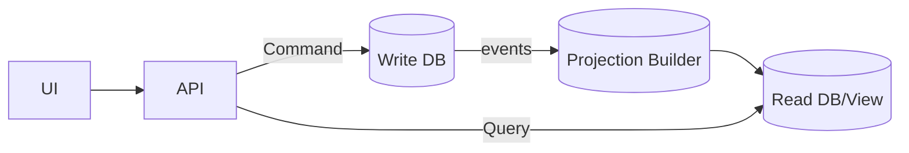

# 🔀 CQRS & 🗃️ Event Sourcing — separating reads/writes and storing events

> Quick idea: **CQRS** splits your app into **writes (commands)** and **reads (queries)** so each side can be optimized. **Event Sourcing** goes further: instead of storing the latest row, you **append events** (“ItemAdded”, “OrderConfirmed”) and rebuild state from them.

---

## 1) CQRS in 60 seconds

- **Commands** change state (no return data beyond IDs/status).
- **Queries** read state (no side-effects).
- Each side can use the **best model & database** (often the same DB at first; later, denormalized read models).



**Why do it?**

- Simpler code: write model enforces **invariants**; read model is **fast & denormalized**.
- Scalability: reads and writes scale **independently**.
- Plays nicely with **DB-per-service** and **events**.

**When to use “CQRS-only”:**

- You have heavy, complex queries and simpler writes.
- You want fast pages (read model) without dangerous joins across services.

---

## 2) Event Sourcing (ES) — the next step

- Store every change as an **event** in an **append-only stream** per aggregate (e.g., one stream per `OrderId`).
- Current state = **fold** (replay) events: `Applied(OrderPlaced)->Applied(ItemAdded)->…`.
- Keep optional **snapshots** to speed up loads.

**Why do it?**

- Perfect audit/history, easy temporal queries (“as of T”), natural integration events.
- Great fit when business is **event-y** (orders, payments, ledgers).

**When _not_ to**

- CRUD-y domains, simple invariants, no need for history → stick to CRUD or CQRS-only.

---

## 3) MegaShop example (CQRS + optional ES)

### Commands & Events

- **Commands:** `PlaceOrder`, `AddItem`, `ConfirmOrder`, `CancelOrder`
- **Events:** `OrderPlaced`, `ItemAdded`, `OrderConfirmed`, `OrderCanceled`

### Write side (aggregate, with ES-style apply)

```csharp
public sealed class Order // aggregate
{
    private readonly List<OrderLine> _lines = new();
    public Guid Id { get; private set; }
    public OrderStatus Status { get; private set; } = OrderStatus.Draft;
    public int Version { get; private set; } // ES optimistic concurrency

    public IEnumerable<object> Place(Guid id) {
        if (Status != OrderStatus.Draft) throw new("Already placed");
        yield return new OrderPlaced(id);
    }

    public IEnumerable<object> AddItem(Guid productId, int qty, decimal price) {
        if (Status != OrderStatus.Draft) throw new("Locked");
        yield return new ItemAdded(productId, qty, price);
    }

    public void Apply(object @event) {
        switch (@event) {
            case OrderPlaced e: Id = e.OrderId; Status = OrderStatus.Draft; break;
            case ItemAdded e: _lines.Add(new(e.ProductId, e.Qty, e.Price)); break;
            case OrderConfirmed: Status = OrderStatus.Confirmed; break;
        }
        Version++;
    }
}
```

### Persisting events (simple SQL table)

```ini
Events(
  Id PK, StreamId (OrderId), Version, Type, DataJson, MetadataJson, CreatedUtc
)
-- Unique(StreamId, Version) to enforce sequence
```

**Append algorithm:** load last `Version`; append with `expectedVersion = current`; if mismatch → concurrency retry.

### Projection (read model) builder

```csharp
public class OrderProjectionHandler {
  public Task Handle(ItemAdded e) {
    // upsert denormalized row for fast reads:
    // OrdersView(OrderId, Status, Total, LinesJson, UpdatedUtc)
  }
}
```

**Queries** hit `OrdersView` (fast, 1 table) rather than joining write tables.

---

## 4) CQRS-only variant (no event store)

- **Write DB**: normal tables + `rowversion` for optimistic concurrency.
- **Read DB/View**: refreshed via **integration events** (Outbox) or **SQL/ETL**.
- You still separate **commands** and **queries** in code (e.g., MediatR handlers), but data is stored in classic rows.

---

## 5) .NET building blocks (practical)

- **Commands/Queries:** MediatR (or plain handlers).
- **Read DB:** separate DbContext/connection (often `NoTracking`).
- **Event Store options:** roll-your-own in SQL (table above), **EventStoreDB**, **Marten** (PostgreSQL), or **Kafka log** + snapshots.
- **Optimistic concurrency:** check `Version` when appending; in EF Core CRUD use `rowversion`.
- **Outbox → Projections:** publish integration events reliably; projection workers update read models.

---

## 6) Operating the model

- **Lag:** reads are **eventually consistent**; for “read-your-write”, read from **primary** or return **202 + trackId** until projection catches up.
- **Snapshots:** every N events store a snapshot `(StateJson, Version)` to speed up loads.
- **Upcasting:** when events evolve, add new fields **additively**; map old → new on load.
- **Rebuilds:** if projection schema changes, **replay** events to rebuild read models.

---

## 7) Pitfalls → fixes

| Pitfall                        | Fix                                                       |
| ------------------------------ | --------------------------------------------------------- |
| Overusing ES for simple CRUD   | Start CQRS-only; add ES **per aggregate** that needs it   |
| Slow loads after many events   | **Snapshots** + capped history windows                    |
| Breaking event schemas         | **Additive** changes + upcasters; never change meaning    |
| “Need strong read-after-write” | Pin to **primary** or return **202** and poll/stream      |
| One giant read model           | Multiple **task-focused** projections; small, rebuildable |

---

## 8) Assessment-ready sound bites

- **CQRS:** “Commands change state, Queries read state. Separate models so each is simple and fast.”
- **Event Sourcing:** “Store **events** as the source of truth; rebuild state by replay. Great for audit and workflows.”
- **Consistency:** “Reads are eventually consistent; use projections and Outbox. For immediate reads, hit the primary or return 202.”
- **Concurrency:** “Append with **expected version**; in CRUD use `rowversion`.”
- **Migrations:** “Change projections freely; events evolve **additively** with upcasters.”

---

## ✅ Pocket checklist

- [ ] Separate **command** and **query** paths (code + DB if needed)
- [ ] Keep **read models** denormalized & rebuildable
- [ ] If using ES: append-only events, **expectedVersion**, **snapshots**
- [ ] Outbox for integration events; projection workers update reads
- [ ] Plan for **lag**, **upcasting**, **replay**; monitor projection delay

> **One-liner:** _Use CQRS to make writes correct and reads fast; add Event Sourcing when you need a perfect history and event-native workflows._
