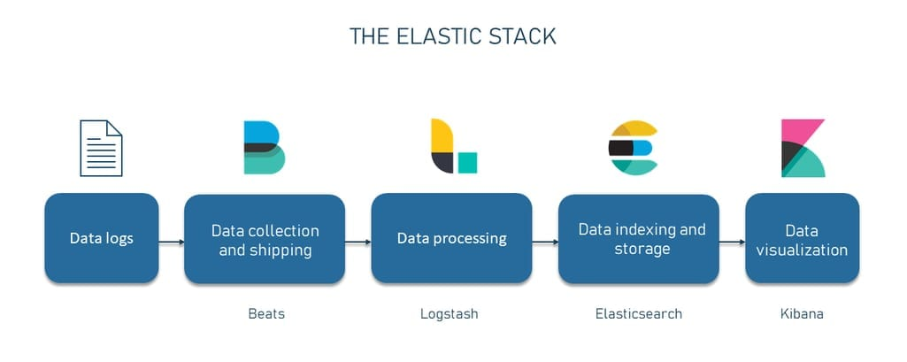
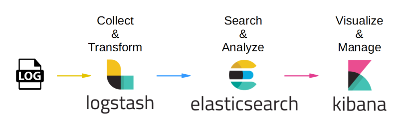
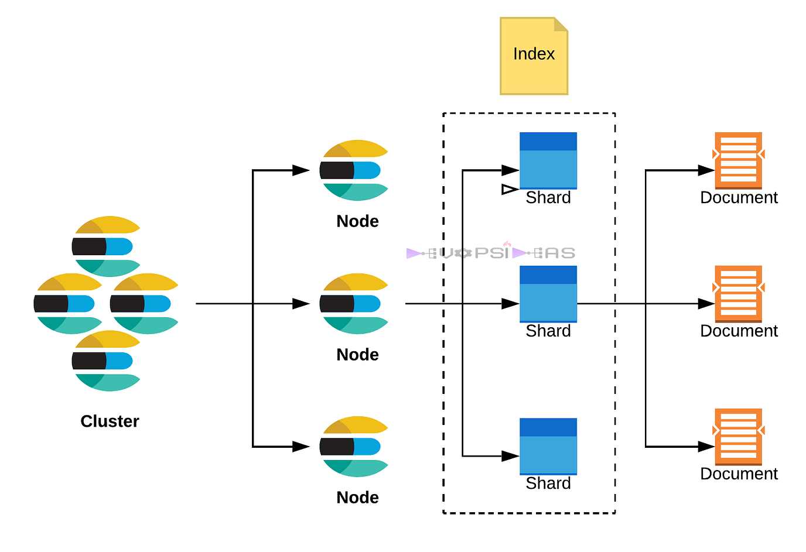

# 🔍 Elasticsearch: The Smart Search Engine Behind the Magic

> _“If Google had a mini-me you could deploy, it would be Elasticsearch.”_

---

<div style="text-align: center;">
    
</div>

---

## 📖 What Is Elasticsearch?

> 🔬 **Official Definition:** > **Elasticsearch** is a **distributed, RESTful search and analytics engine** built on top of **Apache Lucene**. It allows you to store, search, and analyze huge volumes of data quickly — in near real-time.

It’s like having a high-performance librarian who:

- 🧐 Understands what you mean (even when you’re vague)
- 🔎 Can search _millions_ of books instantly
- 🧠 Remembers and ranks relevant stuff smartly

> 🧠 Used for:

- Full-text search 🔤
- Real-time log analytics 📈
- Observability and monitoring 👀
- Metrics dashboards 📊
- Security event detection 🛡

---

<div style="text-align: center;">
    
</div>

---

## 🧩 Core Components of Elasticsearch — One by One (With Emojis!)

Let’s walk through the **smart, Lego-like architecture** of Elasticsearch:

---

### 🧠 1. Cluster – The Brain

> A **cluster** is a collection of **nodes** (servers) working together under one name to hold your data and provide distributed search and indexing.

- Think of it as an **Elasticsearch city** made up of different buildings (nodes).
- You interact with the **cluster** as if it’s one big system.

```json
"cluster.name": "hady-es-prod"
```

---

### 🖥️ 2. Node – The Worker Building

> A **node** is a single **Elasticsearch instance** (Java process) that lives inside a server or VM.
> Each node can have one or more **roles**.

| Node Role                | 🧠 Description                                         |
| ------------------------ | ------------------------------------------------------ |
| 🧠 **Master Node**       | Controls cluster-wide tasks (e.g. create/delete index) |
| 💾 **Data Node**         | Holds actual data and handles CRUD/search              |
| 🧮 **Ingest Node**       | Transforms documents before indexing                   |
| 📡 **Coordinating Node** | Accepts client requests, routes them                   |

---

### 🗂️ 3. Index – The Collection

> An **index** is like a database in Elasticsearch.
> It’s a **logical namespace** that stores related **documents**.

```bash
PUT /users
```

- Each index is split into **shards** (for performance) and **replicas** (for fault tolerance).
- Example indices: `logs-2025-05-01`, `products`, `tweets`, etc.

---

### 📄 4. Document – The Actual Data

> A **document** is a JSON object that represents a **record**.

```json
{
  "user": "hady",
  "message": "hello Elasticsearch!",
  "timestamp": "2025-05-04T12:00:00Z"
}
```

- Stored inside an **index**
- Each document has an automatic `_id`
- Elasticsearch is **schema-free** but supports **mapping**

---

### 🧱 5. Shard – The Slice of Data

> **Shards** divide an index into smaller pieces.
> Each shard is a **fully functional Lucene index**.

- ✂️ Used to distribute data across **nodes**
- 🚀 Enables **parallel processing** of searches
- 📈 By default: 5 primary shards per index (can be changed)

---

### 🔁 6. Replica – The Clone Buddy

> A **replica shard** is a **copy of a primary shard**.

- 🔒 Provides **high availability** (if primary fails, replica takes over)
- 📚 Improves **read performance** by serving more queries
- ❌ Never placed on the same node as its primary

---

### 🧭 7. Mapping – The Data Blueprint

> **Mapping** defines the **schema** for documents in an index.
> Like a blueprint: which fields exist and what type they are.

```json
"properties": {
  "user": { "type": "keyword" },
  "message": { "type": "text" },
  "timestamp": { "type": "date" }
}
```

- `text` → analyzed (good for full-text search)
- `keyword` → not analyzed (good for exact match)
- `date`, `geo_point`, `integer`, etc.

---

### 🔍 8. Analyzer – The Text Processor

> An **analyzer** breaks down text during indexing and searching.
> It’s what gives Elasticsearch its **super-smart search capabilities**.

| Step         | What It Does                        |
| ------------ | ----------------------------------- |
| ✂️ Tokenizer | Breaks text into words              |
| 🧹 Filter    | Lowercases, removes stopwords, etc. |
| 🔤 Stemming  | Reduces words to their root forms   |

```text
"Running quickly" → ["run", "quick"]
```

---

## 🧠 How It All Works Together — in One Diagram

<div style="text-align: center;">
    
</div>

---

> 🔁 Replica shards act like backup musicians 🎸 — if a primary shard goes down, they jump in!

---

## 📋 TL;DR Summary Table

| Component | Emoji | Role                              |
| --------- | ----- | --------------------------------- |
| Cluster   | 🧠    | All nodes grouped under one name  |
| Node      | 🖥️    | Individual Elasticsearch instance |
| Index     | 🗂️    | Logical collection of documents   |
| Document  | 📄    | JSON data stored in an index      |
| Shard     | 🧱    | A slice of index data             |
| Replica   | 🔁    | Redundant copy of a shard         |
| Mapping   | 🧭    | Schema definition                 |
| Analyzer  | 🔍    | Text processing engine            |

---

## 🧪 Real-Life Example

> Let’s say you’re building a log monitoring system.

1. You send logs from your app to **Logstash** or directly to Elasticsearch.
2. Each log is a **document** like:

   ```json
   {
     "level": "ERROR",
     "message": "Database connection failed",
     "timestamp": "2025-05-04T12:01:00Z"
   }
   ```

3. Elasticsearch stores it in an **index** like `logs-2025-05-04`.
4. You search for all `ERROR` messages in Kibana. Elasticsearch:

   - Parses your query
   - Routes it to matching shards
   - Aggregates the results
   - Returns matching logs in milliseconds ⚡

---

## 🔥 Bonus Tip: Behind the Scenes

Elasticsearch is built on top of **Apache Lucene**, a high-performance indexing library.
But Lucene is **hard to use directly** — so Elasticsearch wraps it in a **JSON + RESTful API** so mere mortals (like us) can enjoy it. 😎
