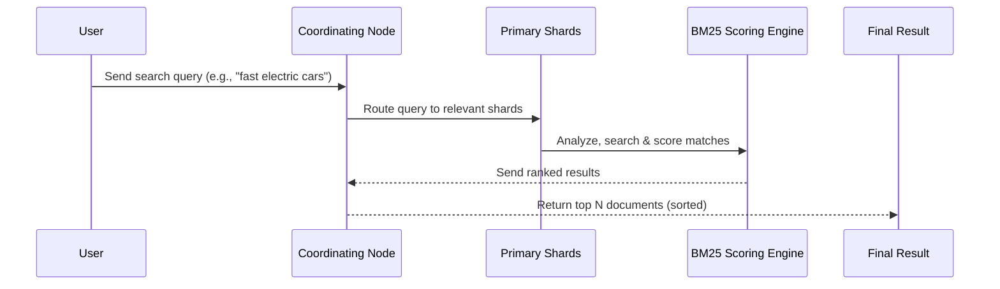

# 📚 **How Search Works in Elasticsearch**

_🤯 From user query → scoring → blazing-fast results!_

---

## 🧠 TL;DR Summary

| Concept 🔍                    | Purpose 📈                            |
| ----------------------------- | ------------------------------------- |
| **Analyzer**                  | Breaks down text for matching         |
| **Inverted Index**            | Links terms → documents               |
| **Query Parser**              | Transforms your query into operations |
| **Scoring (BM25)**            | Ranks results based on relevance      |
| **Shards Search in Parallel** | Boosts speed by distributed execution |

---

## 🧬 The Life of a Search Query

Let’s follow your query on its **journey through Elasticsearch**:



---

## 🔎 Step-by-Step: What Happens When You Search?

---

### 1️⃣ Query is Received 📨

You send something like:

```http
GET /cars/_search
{
  "query": {
    "match": {
      "description": "fast electric cars"
    }
  }
}
```

Elasticsearch sends it to the **coordinating node**, which acts like your smart butler.

---

### 2️⃣ Text is Analyzed 🔍 (Both Search Term & Indexed Text)

**Analyzer** breaks it down:

> "Fast electric cars" → `[fast, electric, car]`

If your documents contain:

- "fast electric car" ✅ Match
- "electric vehicles" ❌ No match unless synonyms/stemming applied

> ⚙️ You can customize analyzers with **tokenizers**, **filters**, **stemmers**, etc.

---

### 3️⃣ Search Happens in the 🔄 Inverted Index

**Inverted Index = Dictionary flipped!**

Instead of:

```json
{
  "doc1": "fast electric car"
}
```

You get:

| Term     | Documents     |
| -------- | ------------- |
| fast     | \[doc1, doc3] |
| electric | \[doc1, doc2] |
| car      | \[doc1, doc3] |

✅ This is why **search is lightning fast**: Elasticsearch looks up terms instantly!

---

### 4️⃣ Documents Are Scored ⚖️ (The Brainy Part)

Elasticsearch uses a smart formula called **BM25** (Better Matching 25) to rank documents by relevance.

> 📘 **BM25 is an evolution of TF-IDF**, and it works like this:

### 📐 BM25 Formula (Simplified)

```math
Score = IDF(term) * ((freq * (k+1)) / (freq + k))
```

| Term     | Meaning                                             |
| -------- | --------------------------------------------------- |
| **IDF**  | Inverse Document Frequency (rarer = more important) |
| **freq** | How often the term appears in the doc               |
| **k**    | Tuning constant (default 1.2)                       |

> 🧠 TL;DR: The more **specific** and **rare** your term, the higher its score if matched.

---

### 5️⃣ Results Are Aggregated and Returned 🚀

The **coordinating node**:

- Gathers top-N results from each shard
- Sorts by score
- Returns you the **best matches first** (unless you sort by timestamp or price etc.)

---

## 🧮 Real Example: Ranked Search

**Let’s say we have 3 docs:**

| Doc ID | Content                        |
| ------ | ------------------------------ |
| 1      | “Fast electric cars are fun”   |
| 2      | “Electric vehicles are rising” |
| 3      | “Buy fast sports cars”         |

**Query:** `"fast electric cars"`

| Doc | Terms Matched        | Score ↑ |
| --- | -------------------- | ------- |
| 1   | fast, electric, cars | 3.2     |
| 3   | fast, cars           | 2.4     |
| 2   | electric             | 1.5     |

Result? 🎯
`doc1` ranks first because it matches all query terms.

---

## 🧠 Behind the Scenes: Why BM25 is Smart

| 🧠 BM25 Knows That…                              | Why It Matters                           |
| ------------------------------------------------ | ---------------------------------------- |
| Common words (like "the", "and") get less weight | They’re not meaningful                   |
| Long documents get slightly penalized            | To prevent verbosity from boosting score |
| Rare terms boost score more                      | Because they’re more specific and useful |

---

## 🧰 Advanced Tuning Options

You can fine-tune search with:

| Option                 | Usage                                   |
| ---------------------- | --------------------------------------- |
| `boost`                | Give more weight to a field             |
| `minimum_should_match` | Require % of query terms to match       |
| `fuzziness`            | Enable typo-tolerant search             |
| `synonyms filter`      | Expand queries (e.g. "car" = "vehicle") |

---

## 🧠 Quick Analogy: BM25 as a Search Judge 🎓

Imagine a judge at a spelling bee:

- Awards high scores to precise, rare answers (IDF)
- Gives more credit to answers that are repeated for emphasis (TF)
- Penalizes overtalkers who ramble (doc length)

---

## ✅ Recap

| Stage              | What Happens                          |
| ------------------ | ------------------------------------- |
| ✍️ Query Input     | You submit your question              |
| 🔍 Analyzer        | Breaks it down into tokens            |
| 📚 Inverted Index  | Finds which docs contain the tokens   |
| ⚖️ BM25 Scoring    | Ranks docs by match strength          |
| 🚀 Result Response | Top N results returned lightning-fast |

---

Would you like the **next topic** to be:

1. 🚀 **Deploying Elasticsearch on AWS (via OpenSearch)**
2. 🛠️ **Building custom analyzers (Arabic, English, synonym-aware)**
3. 🔐 **Security & Access Control in Elasticsearch (IAM, TLS, RBAC)**

Let me know and we’ll jump into it in your favorite enhanced style!
