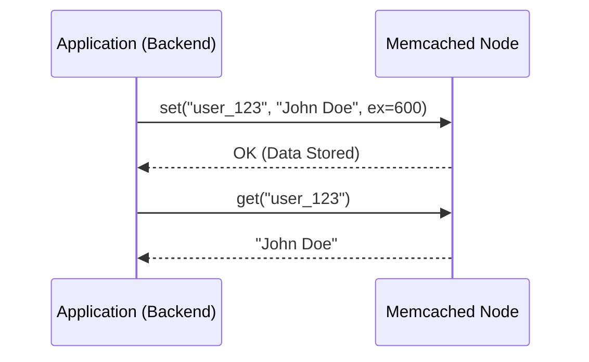

# 🔥 **Understanding Memcached: Internal Architecture & Working Mechanism**

## 📌 **What is Memcached?**

**Memcached** is a high-performance, **distributed in-memory caching system** designed to **reduce database load** and **speed up web applications**.

✅ **Key Features:**

- **Key-Value Store**: Stores data as simple key-value pairs.
- **In-Memory Storage**: All data is stored in **RAM** for ultra-fast access.
- **No Persistence**: Data **is lost if the server restarts**.
- **Multi-Threaded**: Can handle multiple connections efficiently.
- **No Inter-Node Communication**: Each Memcached node is independent.

📌 **Use Case Examples:**

- **Caching database queries** to avoid repeated expensive reads.
- **Session storage** for websites & microservices.
- **Caching API responses** for faster access.

---

## 🏗 **Internal Architecture of Memcached**

Memcached is **designed to be simple and fast**. Let's break it down into its key components:

### 🔹 **1. Memory Management (Slab Allocation)**

💡 **Memcached pre-allocates memory to avoid fragmentation**.

- **Uses "pages" of 1MB** (default size).
- Each page is split into **fixed-size chunks**.
- **Chunks are grouped into "slab classes"** based on their size.

📌 **Example:**

- Slab Class 1 → Stores **small objects (72 bytes)**.
- Slab Class 2 → Stores **medium objects (256 bytes)**.
- Slab Class 3 → Stores **large objects (1MB)**.

🔹 **Why Slab Allocation?**
✔ **Prevents memory fragmentation**.  
✔ **Ensures predictable performance**.

---

### 🔹 **2. How Data is Stored?**

When a key-value pair is stored:
1️⃣ Memcached **hashes the key**.  
2️⃣ It **determines the appropriate slab class** based on value size.  
3️⃣ The data is **stored in an available chunk** within that slab.

📝 **Example:**

```plaintext
set("user_123", "John Doe")
```

- **Key:** `"user_123"`
- **Value:** `"John Doe"`
- **Memcached assigns it to a slab class that fits the value size.**

---

### 🔹 **3. Key Lookup (Hash Table)**

📌 **How does Memcached quickly find a stored value?**
1️⃣ The key is **hashed using a hash function** (e.g., MurmurHash).  
2️⃣ The hash **determines the index in the hash table**.  
3️⃣ The **value is retrieved from memory in O(1) time**.

📝 **Example:**

```plaintext
get("user_123") → Returns "John Doe"
```

🚀 **Benefit?**  
✔ **Near-instantaneous key lookup** for fast caching.

---

### 🔹 **4. Cache Eviction (LRU - Least Recently Used)**

⚠ **What happens when memory is full?**

- **Memcached follows the LRU (Least Recently Used) eviction policy.**
- **Oldest unused keys are removed first** to make space for new data.

📝 **Example:**

```plaintext
Cache is full → Oldest accessed item is removed.
```

🚀 **Benefit?**  
✔ Ensures **frequently used** data remains in cache.  
✔ Prevents cache from growing indefinitely.

---

### 🔹 **5. Data Expiration (TTL - Time-To-Live)**

Memcached allows setting an **expiration time (TTL) on stored items**.

📌 **Example:**

```plaintext
set("session_456", "User Data", ex=300)  → Expires in 5 minutes.
```

🚀 **Benefit?**  
✔ **Ensures cache is refreshed periodically**.  
✔ **Prevents stale data from being served**.

---

### 🔹 **6. How Reads & Writes Work?**

📝 **Step-by-Step Data Flow in Memcached**



📌 **Read Process:**
1️⃣ The **client requests data** using a key.  
2️⃣ Memcached **looks up the key in the hash table**.  
3️⃣ If found → **Returns the value** (O(1) time).  
4️⃣ If not found → **Cache miss** (Application fetches from DB and stores it back in Memcached).

📌 **Write Process:**
1️⃣ Client sends **set(key, value)** request.  
2️⃣ Memcached **determines the correct slab class**.  
3️⃣ The **data is stored in memory**.  
4️⃣ **Oldest (least used) data is evicted** if necessary.

🚀 **Benefit?**  
✔ **Super-fast lookups & writes (~sub-millisecond latency).**

---

## ⚡ **How Memcached Handles Multiple Nodes? (Distributed Caching)**

**Memcached does NOT handle replication or node discovery** by itself.  
💡 Instead, the **client** is responsible for choosing which Memcached node to store/retrieve data from.

### 🔹 **1. Hash-Based Routing (Modulo Hashing)**

- Each request is **hashed** using a hash function.
- The **hash is mapped to a specific node** in the Memcached cluster.
- Example formula:

```plaintext
node_index = hash(key) % total_nodes
```

📌 **Example:**

```plaintext
hash("session_123") % 4 → Node 2
hash("session_789") % 4 → Node 3
```

🚀 **Benefit?**  
✔ Distributes load evenly across all nodes.

---

### 🔹 **2. What Happens When a Node Fails?**

⚠ **Problem with Modulo Hashing?**

- If **a node fails or new nodes are added**, **all hash mappings change**.
- This leads to **cache misses and increased database load**.

✅ **Solution: Consistent Hashing**

- Instead of `% total_nodes`, **keys are mapped to a hash ring**.
- **Only affected keys** are re-mapped when a node fails.

📌 **How It Works?**

```plaintext
1️⃣ Hash each key onto a "virtual ring".
2️⃣ Find the next available node clockwise.
3️⃣ Only a small percentage of keys move if a node is removed.
```

🚀 **Benefit?**  
✔ **Minimizes cache misses during scaling.**  
✔ **Ensures smoother auto-scaling in distributed systems.**

---

## 🛠 **Best Practices for Memcached**

✅ **Use Consistent Hashing for Distributed Caching**

- Prevents cache misses during scaling.

✅ **Set Expiration (TTL) Wisely**

- Avoids serving stale data.

✅ **Avoid Storing Large Objects (Limit to ~1MB)**

- Memcached works best for small, frequently accessed items.

✅ **Monitor Hit Ratio & Cache Misses**

- Use CloudWatch or Prometheus to track cache performance.

✅ **Use LRU Eviction to Remove Old Data**

- Ensures only relevant data stays in cache.

---

## 🎯 **Key Takeaways**

✔ **Memcached is a simple, fast, in-memory key-value store.**  
✔ **Uses slab allocation to prevent memory fragmentation.**  
✔ **Implements LRU eviction to remove old keys when memory is full.**  
✔ **Does NOT support replication or persistence.**  
✔ **Clients use hash-based routing to distribute keys across multiple nodes.**  
✔ **Consistent Hashing helps minimize cache misses when scaling.**

🚀 **Memcached is the best choice for ultra-fast, non-persistent caching where simplicity and speed are the top priorities!**

---

🔥 **Does this breakdown match your expectations?** 😊
