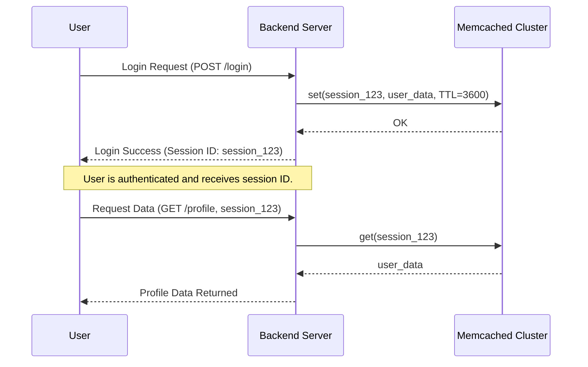
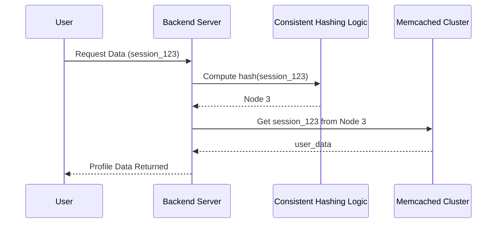
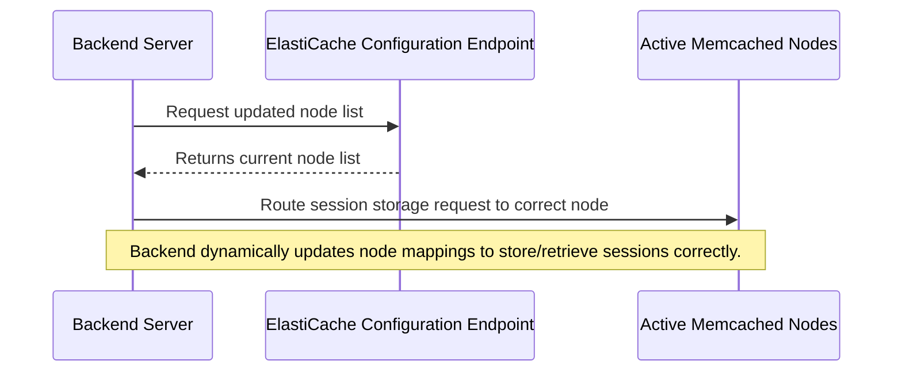

# 🗺️ **Memcached For Backend Session Caching**

## 📌 **What is Session Caching?**

Session caching stores **user session data** in an in-memory key-value store (like **Memcached**) to speed up access and reduce database load.

✅ **Why Use Memcached for Sessions?**

- 🚀 **High-speed access** to session data.
- ⚡ **Reduces database load** by avoiding frequent DB reads.
- 🔄 **Stateless backend** → Sessions are stored centrally.
- 🔁 **Supports distributed environments** (multiple backend servers can share the same cache).

---

## 🤔 **How Memcached Handles Distributed Session Caching**

Memcached is **not aware of multiple nodes** in a cluster. Instead, the **client is responsible** for:

- 1️⃣ **Determining which node should store a session**.
- 2️⃣ **Ensuring the same session ID always maps to the same node**.
- 3️⃣ **Handling cache misses if a session is lost due to node failure**.

### 🔍 **Traditional Session Caching Setup:**

In a **multi-server backend**, session data needs to be **shared across all instances**. Otherwise, a user might be routed to a different server and lose their session.

✅ **Solution**: Store session data in Memcached **instead of keeping it in memory per backend instance**.

---

## 📌 **Why Session Mapping Between Memcached Cluster Nodes Matters in a Distributed Cache**

In **multi-node Memcached clusters**, session data must be consistently stored and retrieved across **multiple backend servers**. The challenge is ensuring that:

- **User sessions always map to the correct Memcached node.**
- **Session retrieval is fast and reliable, even if nodes are added or removed.**
- **The system handles cache misses efficiently to avoid unnecessary database lookups.**

---

## 🤔 **How Memcached Maps Sessions to Nodes**

Memcached **does not handle session distribution itself**—instead, **the client** (backend application) is responsible for:

- 1️⃣ **Determining which node stores a session**.
- 2️⃣ **Ensuring the same session ID maps to the same node**.
- 3️⃣ **Handling session retrieval efficiently**.

### ✅ **Traditional Hashing for Session Mapping**

Most basic Memcached setups use **Modulo Hashing**:

```plaintext
node_index = hash(session_id) % total_nodes
```

- The backend **hashes the session ID** and determines the target **Memcached node**.
- **Same session ID always maps to the same node** (as long as `total_nodes` remains the same).

🚨 **Issue:**  
If a new node is added or removed, **all session mappings shift**, leading to:

- **Cache misses** → The backend cannot find sessions.
- **Increased database queries** → Session data must be reloaded from the database.
- **Users losing sessions unexpectedly**.

---

## 🔄 **Consistent Hashing: A Better Approach to Session Mapping**

Instead of `hash(session_id) % total_nodes`, **Consistent Hashing** maps sessions **more efficiently**.

### 🔹 **How Consistent Hashing Works**

- 1️⃣ **Each Memcached node is assigned positions on a "hash ring".**
- 2️⃣ **Session IDs are hashed and placed on the ring.**
- 3️⃣ **Each session maps to the closest node clockwise.**
- 4️⃣ **If a node is removed, only affected sessions are re-mapped.**

🚀 **Why This Works Better?**

- ✔ **Minimal session loss when scaling**.
- ✔ **Better load balancing across nodes**.
- ✔ **Avoids complete remapping of sessions**.

---

## 🔄 **Session Storage Workflow (Traditional Memcached - Fixed Nodes)**

### **Scenario: A user logs in, and their session is stored in Memcached.**



---

### **Session Read with Consistent Hashing**



---

## 🌍 **Session Mapping in AWS Auto-Scaling Memcached**

### 📌 **Problem: Traditional Hashing Fails with Auto-Scaling**

🛑 **If you use traditional hashing (`hash(session_id) % total_nodes`)**, this approach **breaks** when nodes are added or removed dynamically:

- **New nodes change the total count (`total_nodes`)** → Sessions may get mapped to different nodes unexpectedly.
- **Cache misses increase** → Users lose their sessions **even though they are still in the cluster**.

---

### 🛠 **Solution: AWS Auto Discovery for Memcached**

#### ✅ **How AWS Solves It**

Instead of manually tracking **total_nodes**, **AWS ElastiCache provides an Auto Discovery feature**, which works as follows:

#### 🔄 **How Auto Discovery Works**

1️⃣ **Application Starts & Connects to the ElastiCache Configuration Endpoint** 🏗

- Instead of a **fixed list of nodes**, the application connects to **one static endpoint**.
- This **endpoint dynamically provides an updated list of active Memcached nodes**.

2️⃣ **Client Library Fetches Updated Node List** 🔄

- AWS provides an **updated node list whenever scaling happens**.
- **No need to hardcode total_nodes**—the client **always gets the latest active nodes**.

3️⃣ **Client Uses Consistent Hashing (with Virtual Nodes)**

- Instead of simple modulo hashing, AWS recommends **Consistent Hashing with Virtual Nodes**.
- This method ensures that **only a small portion of session data is remapped when a node is added/removed**.

---

### 🔄 **How AWS Handles Scaling Events**

🔹 **Scenario 1: Scaling Up (Adding More Nodes)**

1. **ElastiCache adds new nodes to the cluster**.
2. **Auto Discovery updates the client with new node details**.
3. **Client redistributes only some session keys** to the new nodes **(minimal session loss).**
4. **New requests follow the updated hash mapping to fetch session data**.

🔹 **Scenario 2: Scaling Down (Removing Nodes)**

1. **ElastiCache removes a node** from the cluster.
2. **Auto Discovery informs clients about the removed node**.
3. **Client reassigns only affected keys to remaining nodes**.
4. **Most existing session mappings remain unchanged**.

---

### 🔄 **How Auto Discovery Works (Mermaid Diagram)**



---

### ✅ **Implementing AWS Auto Discovery in Code**

**Python Example with `boto3` and `pylibmc`**

```python
import pylibmc

# Use AWS ElastiCache Configuration Endpoint (instead of manual node list)
config_endpoint = "my-elasticache-cluster.cfg.use1.cache.amazonaws.com"

# Connect using Auto Discovery
client = pylibmc.Client([config_endpoint], binary=True, behaviors={"tcp_nodelay": True, "ketama": True})

# Store a session (auto-routed to correct node)
client.set("session:USER_123", {"user_id": "USER_123", "role": "admin"}, time=3600)

# Retrieve session data
session_data = client.get("session:USER_123")
print(session_data)
```

---

## 🛠 **Best Practices for Session Mapping**

✅ **Always use the AWS ElastiCache Configuration Endpoint**

- Never hardcode IP addresses or manually track node lists.

✅ **Enable Auto Discovery in Client Library**

- Ensure the client **auto-updates its node list** when scaling happens.

✅ **Use Consistent Hashing with Virtual Nodes**

- Prevents massive session invalidation when nodes change.

✅ **Use Short TTLs for Sessions**

- Avoids long-lived sessions that might be affected by scaling events.

✅ **Monitor Cache Miss Rate in CloudWatch**

- If session cache misses increase, investigate if nodes are frequently changing.

---

## 🎯 **Key Takeaways**

- ✔ **Memcached is ideal for session caching due to its low latency.**
- ✔ **Traditional hashing (`% total_nodes`) is inefficient for auto-scaling.**
- ✔ **Consistent Hashing improves session persistence during scaling events.**
- ✔ **AWS ElastiCache Auto Discovery dynamically updates the node list for clients.**
- ✔ **Auto Discovery + Consistent Hashing ensures reliable session storage in dynamic environments.**
