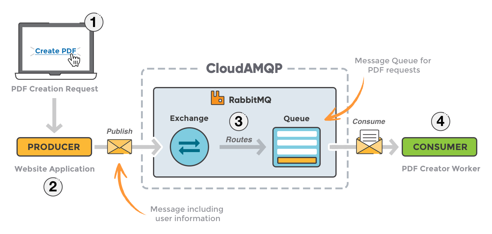
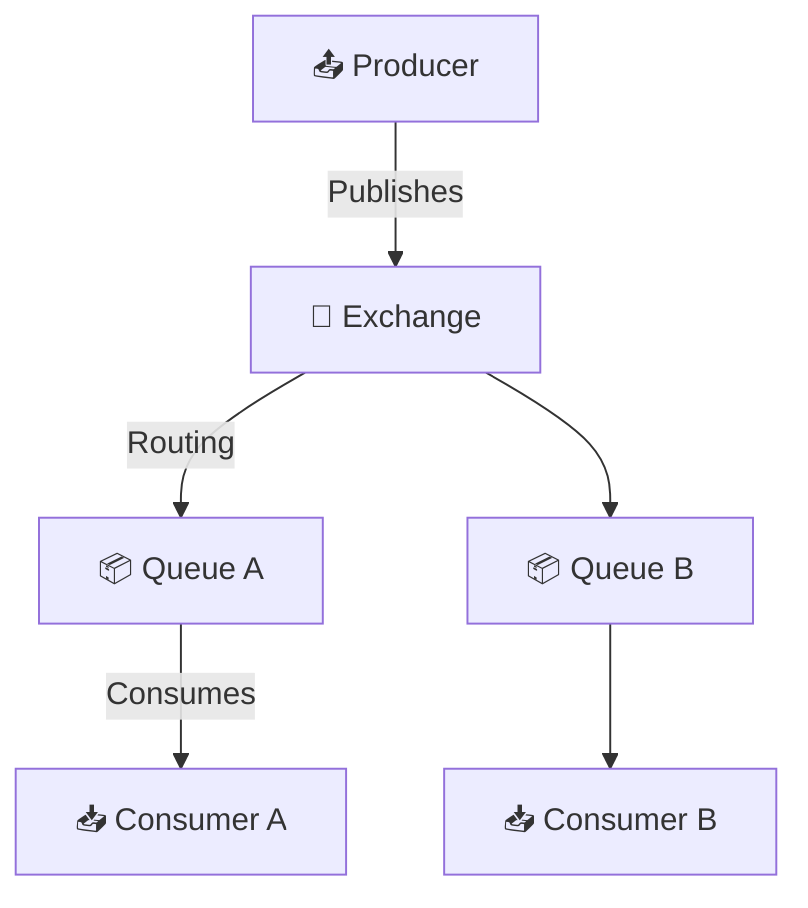
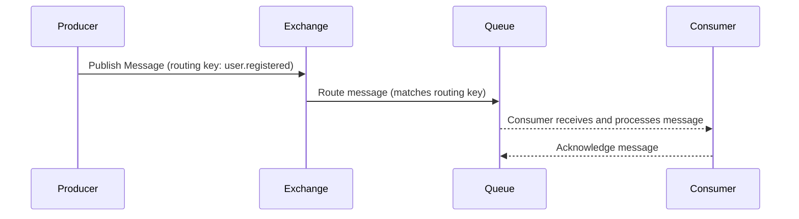

# 🐇 **RabbitMQ: The Friendly Postman of Messaging Systems**

## 📋 **What is RabbitMQ?**

> 🧠 **Official Definition:** > **RabbitMQ** is an open-source **message broker** — a software that enables **asynchronous communication** between applications by sending and receiving **messages via queues**.

💡 **In Human Terms:**
Think of RabbitMQ as a reliable **post office clerk**. 🧑‍✈️
Apps (producers) send letters (messages) to queues, and other apps (consumers) pick them up **whenever they’re ready** — no rushing, no dropping!

---

  

---

## 🧱 **RabbitMQ Architecture Overview**

---

## ⚙️ **Core Components of RabbitMQ**

Let’s meet the players of this messaging drama:

---

### 📤 1. **Producer**

- Sends messages to **exchanges** (not directly to queues).
- Doesn’t care where the message goes — it’s RabbitMQ’s job to **route** it properly.
- 🧪 Example: A user registration service sends a “WelcomeEmail” event.

---

### 🧩 2. **Exchange**

- Receives messages from producers.
- Routes messages to **queues** based on **routing rules**.
- Types of exchanges:

  | Type      | Behavior                                   |
  | --------- | ------------------------------------------ |
  | `direct`  | Routes by exact routing key match          |
  | `topic`   | Routes by pattern matching (e.g. `user.*`) |
  | `fanout`  | Broadcasts to all bound queues             |
  | `headers` | Routes based on header attributes          |

🧠 Analogy: An exchange is like a **mail sorter** — decides which mailbox (queue) gets the letter.

---

### 📦 3. **Queue**

- A **buffer** that stores messages until consumers are ready to process them.
- Messages stay here until acknowledged.
- FIFO (First In, First Out), unless configured otherwise.

---

### 📥 4. **Consumer**

- Subscribes to queues and processes messages.
- Can **acknowledge** a message to let RabbitMQ know it was handled.
- Can be **multiple consumers** per queue for **load balancing**.

---

### 🔗 5. **Binding**

- A **link** between an exchange and a queue.
- May contain **routing key** or pattern logic.

🧵 Example:
Exchange `logs` → Queue `log_errors`
Routing key = `error.*` — only error messages go in.

---

### 📑 6. **Message**

- JSON, XML, or binary payload.
- Includes headers, routing key, and body.
- Can be **persistent** or **transient**.

---

## 🧠 Simple Analogy

| RabbitMQ Component | Mailroom Equivalent |
| ------------------ | ------------------- |
| Producer           | Sender              |
| Exchange           | Mail sorter         |
| Queue              | Mailbox             |
| Consumer           | Mail picker         |
| Binding            | Sorting rule        |
| Message            | Letter              |

---

## 🔄 **How RabbitMQ Works: Step-by-Step**

1. **Producer** sends message → **Exchange**
2. **Exchange** decides routing → sends to **Queue**
3. **Consumer** reads from queue
4. Message is **acknowledged**, then deleted

---

## 🧩 Types of Exchange (With Examples)

| Exchange Type | Use Case Example                                         |
| ------------- | -------------------------------------------------------- |
| `direct`      | Routing logs like `error`, `info`, `debug`               |
| `topic`       | Routing with wildcards → `user.*`, `*.error`             |
| `fanout`      | Broadcast to all → sending notifications to all services |
| `headers`     | Match by message header (not routing key)                |

---

## 🌟 **Key Features of RabbitMQ**

| 🚀 Feature            | 💬 Description                                 |
| --------------------- | ---------------------------------------------- |
| 🧵 Queue-based        | Decouples producer/consumer logic              |
| ⚡ Lightweight        | High-throughput, low-latency                   |
| 📦 Message Durability | Persistent queues and messages                 |
| 🔄 Acknowledgements   | Messages processed reliably                    |
| 🧩 Flexible Routing   | Direct, topic, fanout, headers                 |
| 🛡 TLS/SASL/ACLs       | Secure and authenticated communication         |
| 📊 Monitoring         | Web UI, CLI tools, and plugins                 |
| 🌐 Multi-protocol     | Supports AMQP, MQTT, STOMP, HTTP (via plugins) |

---

## 📚 Use Cases of RabbitMQ

| Scenario                       | How RabbitMQ Helps                        |
| ------------------------------ | ----------------------------------------- |
| 🛍 E-commerce Order System      | Decouple checkout and email confirmations |
| 📧 Email Notification System   | Queue + retry failed email sends          |
| 📈 Logging Infrastructure      | Async log processing and filtering        |
| ⚙️ Microservices Communication | Loose coupling and retry logic            |
| 📦 Task Queues                 | Background jobs and delayed processing    |

---

## 🧪 Real-World Example: Email Queue

**Scenario:**
A web app registers users and sends a welcome email.

- 👨‍💻 App (Producer): Sends `{ "type": "WelcomeEmail", "userId": 123 }`
- 🧩 Exchange: Matches routing key `email.welcome`
- 📦 Queue: `email-welcome-queue`
- 📨 Consumer: Sends email, acknowledges message

🎯 Benefit: Email send failures don’t affect user registration speed.

---

## 🛠 Tools for RabbitMQ

| Tool               | Use                                                         |
| ------------------ | ----------------------------------------------------------- |
| 🖥 RabbitMQ UI      | Visual dashboard (localhost:15672)                          |
| 🐚 `rabbitmqctl`   | CLI tool for management                                     |
| 🔌 Plugins         | Enable extra features like Shovel, Federation, Delayed Msgs |
| 🧪 Test Frameworks | `TestContainers`, `Docker Compose`, `MassTransit` for .NET  |

---

## ☁️ RabbitMQ in the Cloud

- **CloudAMQP** → RabbitMQ as a Service
- **AWS MQ** → Managed broker (AMQP support)
- **Azure Service Bus** → Similar concept but proprietary

---

## 🔄 Advanced Features

### ✅ Acknowledgements

- `autoAck=false`: Wait for consumer to manually ACK (default)
- Prevents message loss from crashing apps

### 🔁 Redelivery & Retry

- If a message isn’t acknowledged, RabbitMQ re-queues it.
- Use **dead-letter exchanges (DLX)** to capture failed ones.

### ⏲ Delayed Messaging (With Plugin)

- Delay a message (e.g., retry after 10 seconds)
- Requires `rabbitmq_delayed_message_exchange` plugin

### 🔐 Authentication and ACLs

- RabbitMQ supports:

  - TLS for encrypted channels
  - SASL for authentication
  - Per-user access control per vhost

---

## 🚫 Limitations

| 🔥 Limitation           | Explanation                                               |
| ----------------------- | --------------------------------------------------------- |
| 🧠 Memory-bound Queues  | Not ideal for massive queues (use Kafka for huge streams) |
| 🔁 Not Built for Replay | Once acknowledged, messages are gone                      |
| 📉 Slower for Analytics | Use Kafka for data lake ingestion                         |

---

## 🧠 RabbitMQ vs Kafka

| Feature        | RabbitMQ                   | Kafka                           |
| -------------- | -------------------------- | ------------------------------- |
| Model          | Queue-based                | Log-based                       |
| Message Replay | ❌ Not native              | ✅ Built-in                     |
| Ordering       | Per queue                  | Per partition                   |
| Durability     | Medium (ack + persistence) | Very high (write-ahead log)     |
| Use Case       | Task queues, Microservices | Data pipelines, logs, analytics |

---

## 📦 Conclusion

RabbitMQ is:

✅ Lightweight  
✅ Easy to set up  
✅ Super useful for decoupling services  
✅ Your best friend in **task queues**, **event-driven microservices**, and **email systems**

🧠 But if you’re moving **massive streams** of real-time data and need **message replay**, Kafka might be your next tool.

---

Would you like the next topic to be:

- 🧪 RabbitMQ + .NET Integration (MassTransit, EasyNetQ)?
- 🔄 Retry & DLX (Dead Letter Exchange) patterns in real apps?
- ☁️ RabbitMQ in Docker or Kubernetes with Helm?
