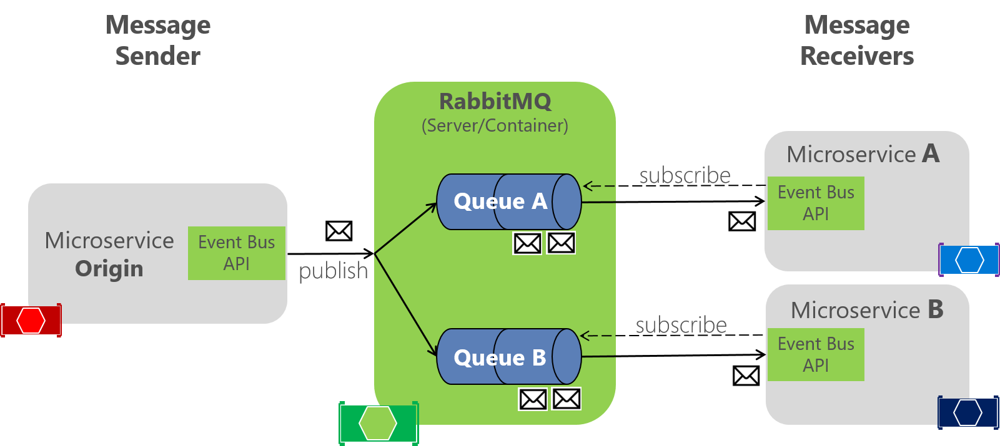
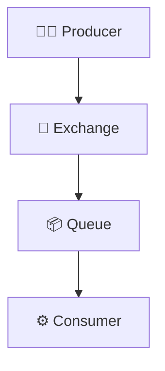
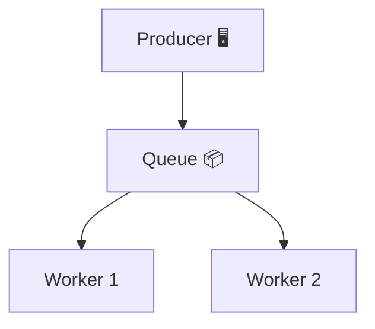

# 🧱 **Topic 1: What Is RabbitMQ & Messaging Patterns?**

> Before we write a line of code, let’s build the mental model 🧠 of **what RabbitMQ is**, **how it works**, and **what patterns it supports** — so we don’t treat it like a black box.

---

<div style="text-align: center;">
    
</div>

---

## 🐇 What is RabbitMQ?

> 🧠 **RabbitMQ** is a **message broker** — a middleman software that helps different parts of an application **communicate asynchronously** using **messages**.

Think of it like a **smart mailroom clerk** 🧑‍✈️:

- You **drop off messages** (like “Send an Email”)
- RabbitMQ **puts them in queues**
- Other services **pick them up when ready** and act on them

---

## 🔄 Why Use a Message Broker?

| 🧨 Problem in Direct Communication              | 💡 RabbitMQ Helps With...                  |
| ----------------------------------------------- | ------------------------------------------ |
| Tight coupling between sender and receiver      | ✅ Loose coupling via queues               |
| Can't scale when consumers are overloaded       | ✅ Buffers data using queues               |
| Immediate failures cause system crashes         | ✅ Supports retries and fault tolerance    |
| Services need to wait for each other (blocking) | ✅ Async message delivery                  |
| Hard to add more consumers later                | ✅ Pub/Sub architecture makes scaling easy |

---

## ⚙️ Core Concepts in RabbitMQ

| Concept      | Description                                                       |
| ------------ | ----------------------------------------------------------------- |
| **Producer** | App that sends a message (like "create user")                     |
| **Exchange** | Routes the message to the correct queue(s) based on routing rules |
| **Queue**    | Holds messages until consumed                                     |
| **Consumer** | App that picks up messages and processes them                     |



---

## 🧩 Supported Messaging Patterns

RabbitMQ is very flexible and supports multiple **message exchange patterns**:

---

### 📬 1. **Work Queue (Task Distribution)**

> One producer sends messages → multiple consumers take turns processing

🧪 Use case: Background job processing (e.g., emails, resizing images)



---

### 📢 2. **Publish/Subscribe (Fanout)**

> One message gets **copied** to all bound queues → each consumer receives a copy

🧪 Use case: Logging, metrics, notifications

```mermaid
graph TD
  A[Producer] --> E[Exchange 🎙 (fanout)]
  E --> Q1[Queue A]
  E --> Q2[Queue B]
  Q1 --> C1[Consumer A]
  Q2 --> C2[Consumer B]
```

---

### 🎯 3. **Routing (Direct Exchange)**

> Messages go to queues with a **matching routing key**

🧪 Use case: Processing specific types of messages (like `order.created`, `order.cancelled`)

```mermaid
graph TD
  A[Producer] --> E[Exchange 🎯 (direct)]
  E -->|order.created| Q1[Queue A]
  E -->|order.cancelled| Q2[Queue B]
```

---

### 🔎 4. **Topic Exchange (Wildcard Routing)**

> Supports **wildcards** in routing keys (`user.*`, `*.error`, etc.)

🧪 Use case: Fine-grained log filtering, event categorization

```mermaid
graph TD
  A[Producer] --> E[Exchange 🔎 (topic)]
  E -->|user.signup| Q1[Queue A]
  E -->|user.*| Q2[Queue B]
```

---

### 🧢 5. **Headers Exchange**

> Route based on **custom headers**, not routing keys

🧪 Use case: When message metadata is complex or dynamic

---

## ✅ Summary

| Concept        | RabbitMQ Role                      |
| -------------- | ---------------------------------- |
| 🔀 Exchange    | Traffic controller for messages    |
| 📦 Queue       | Buffer between producer & consumer |
| 🧑‍💻 Producer | Sends messages                     |
| 🧑‍🔧 Consumer | Processes messages                 |

---

## 🧠 Key Takeaways

✅ RabbitMQ is great for:

- **Decoupling services**
- **Asynchronous task processing**
- **Scalable microservices**
- **Reliable delivery with retries and ACKs**
