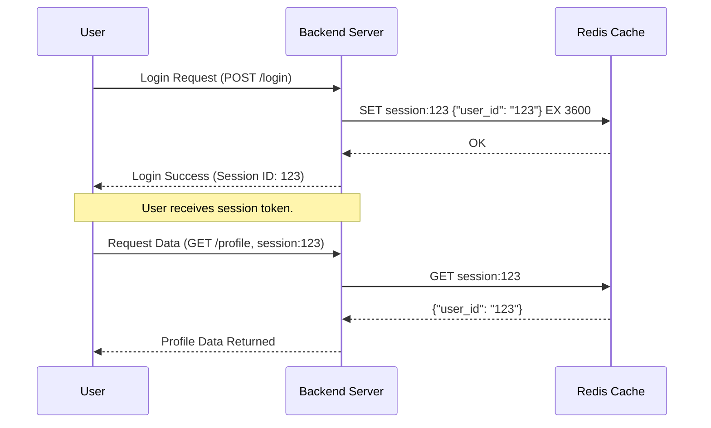

# 🔥 **Redis: Internal Architecture & How It Works**

## 📌 **What is Redis?**

**Redis (Remote Dictionary Server)** is an **in-memory, key-value store** that supports **persistent storage, data structures, pub/sub messaging, and high availability**. Unlike traditional databases, Redis **stores all data in memory** for **ultra-fast performance**.

🔹 **Key Features:**

- **Blazing fast performance** ⚡ (~1ms latency).
- **Supports multiple data structures** (Strings, Lists, Sets, Hashes, Sorted Sets, Streams, Bitmaps, and more).
- **Persistence** (AOF & RDB snapshots for durability).
- **High Availability & Replication** (Master-Slave replication).
- **Supports Transactions & LUA Scripting**.
- **Pub/Sub Messaging & Streams for event-driven architectures**.

> 💡 Redis is designed to be **simple yet powerful**. Internally, it follows a **single-threaded, event-driven architecture**.

---

## 🌥️ **Deployment mode**

| **Mode**                  | **Master Node(s)**                  | **Use Case**                       |
| ------------------------- | ----------------------------------- | ---------------------------------- |
| **Standalone**            | ✅ One master                       | Simple setups, dev/test workloads  |
| **Master-Slave (Legacy)** | ✅ One master, multiple replicas    | High availability, manual failover |
| **Redis Sentinel**        | ✅ One master, multiple replicas    | HA with automatic failover         |
| **Redis Cluster**         | ✅ Multiple masters (sharded setup) | **Scale out**, auto partitioning   |

---

## 🔄 **How Redis Handles Requests**

### **1️⃣ The Event Loop (Single-Threaded I/O Model)**

Redis runs a **single-threaded event loop** that:

- **Handles incoming commands from clients**.
- **Executes operations in memory**.
- **Sends responses back to clients**.

📌 **Why single-threaded?**

- ✔ **No context switching overhead**.
- ✔ **No need for complex locks**.
- ✔ **More predictable performance**.
- ✔ **CPU-bound tasks are rare; Redis is I/O bound**.

### **2️⃣ Memory Management**

- **All data is stored in RAM** → Ultra-fast lookups.
- Uses **pointers for efficient storage**.
- Implements **compression for large values**.
- Supports **LRU (Least Recently Used) eviction policies**.

### **3️⃣ Data Persistence (AOF & RDB Snapshots)**

Redis **persists data** even though it's in memory.  
It provides **two persistence methods**:

| **Persistence Mode**       | **How It Works**                                              | **Best Use Case**                         |
| -------------------------- | ------------------------------------------------------------- | ----------------------------------------- |
| **RDB (Snapshotting)**     | Saves the dataset to disk at intervals (forks child process). | Fast recovery, low impact on performance. |
| **AOF (Append Only File)** | Logs every write operation in real-time.                      | Full durability, ensures no data loss.    |

🚀 **Best Practice:** Use **AOF + RDB hybrid mode** for **optimal durability & recovery speed**.

---

## 🔗 **How Redis Stores & Retrieves Data**

### **1️⃣ Data Structures & Encoding**

Redis supports various **data structures** that are optimized for different use cases.

| **Data Type**   | **Usage**                        | **Storage Optimization**                            |
| --------------- | -------------------------------- | --------------------------------------------------- |
| **Strings**     | Caching, session storage         | Uses **SDS (Simple Dynamic String)** for efficiency |
| **Lists**       | Task queues, chat messages       | Uses **Linked Lists or QuickLists**                 |
| **Hashes**      | User profiles, JSON storage      | Uses **Ziplist or HashTable**                       |
| **Sets**        | Unique tag storage, leaderboards | Uses **HashTable or Intset**                        |
| **Sorted Sets** | Ranking systems                  | Uses **SkipLists**                                  |
| **Bitmaps**     | Tracking user activity           | Uses **Compact bitwise storage**                    |

### **2️⃣ Memory Optimization Techniques**

- **Small Strings (<64 bytes) stored inline** instead of full objects.
- **Ziplist encoding** used when **small Hashes/Sets**.
- **Lazy Deletion** removes expired keys only when accessed.

---

## 🔄 **Redis Replication & High Availability**

Redis supports **Master-Replica replication** for high availability.

### ✅ **How Replication Works**

- 1️⃣ **Master node receives writes**.
- 2️⃣ **Replicas replicate data asynchronously**.
- 3️⃣ If the **Master fails**, a **Replica can be promoted**.

🔹 **Types of Replication:**

- **Full Sync**: When a new replica connects, Redis sends the entire dataset.
- **Partial Sync**: If a replica temporarily disconnects, Redis sends only the missing changes.

### 🔥 **Redis Sentinel (Automatic Failover)**

- **Monitors Redis instances**.
- **Automatically promotes a Replica** if the Master fails.
- **Prevents split-brain scenarios**.

---

## 🚀 **How Redis Handles Scaling**

Redis supports **two main scaling strategies**:

### **1️⃣ Vertical Scaling (Single Node)**

- Increase **RAM** to handle more keys.
- **Not suitable for high write workloads**.

### **2️⃣ Horizontal Scaling with Redis Cluster**

- **Distributes keys across multiple nodes**.
- **No single point of failure**.
- Supports **partitioning (sharding)** for massive datasets.

🔹 **Sharding Strategy:**

1. Each node **handles a subset of the keyspace**.
2. **Keys are mapped using hash slots (0-16383)**.
3. A **Cluster Coordinator ensures data is balanced**.

---

## 🔄 **How Redis Handles Sessions (Compared to Memcached)**

Redis can be used for **session caching**, just like Memcached.

### ✅ **Advantages of Redis for Sessions**

- ✔ **Data Persistence (Memcached loses data on restart).**
- ✔ **Better Eviction Policies (Custom LRU, LFU, etc.).**
- ✔ **Efficient Data Structures (Hashes for session storage).**
- ✔ **High Availability with Replication.**

---

### 🔄 **Session Storage Workflow in Redis (Mermaid Sequence Diagram)**

---

## 🎯 **Key Takeaways**

- ✔ **Redis is a high-performance, in-memory store with persistence options.**
- ✔ **Uses a single-threaded event loop for ultra-fast request processing.**
- ✔ **Supports multiple data structures optimized for different use cases.**
- ✔ **Provides replication, clustering, and automatic failover for high availability.**
- ✔ **Ideal for caching, real-time analytics, pub/sub messaging, and session storage.**

🔥 **Redis is not just a cache—it’s a powerful data store with high availability, scalability, and persistence!**
