# 🚀 Redis Cluster Scaling in AWS (with Best Practices & Failure Handling)

Redis Cluster is a native sharding solution that:

- **Partitions data** across multiple Redis nodes (horizontal scaling).
- Uses **hash slots** (0–16383) to distribute keys.
- Allows **automatic failover** using masters and replicas.

> Think of it as "many Redis servers working together" to store large datasets while avoiding a single point of failure.

---

<div style="text-align: center; background-color: white; border-radius: 10px; padding: 10px;">
  
</div>

---

## 🗃️ **Redis Cluster Architecture** (Multiple Masters)

In a **Redis Cluster**, the keyspace is divided into **16,384 hash slots**. These hash slots are essentially partitions of the entire keyspace. Here's how it works:

1. **Hashing Keys**: When you insert a key into a Redis Cluster, Redis computes a hash of the key using a hashing function (a CRC16 algorithm). The result of this calculation determines which hash slot (out of the 16,384 available slots) the key belongs to.

2. **Distributing Slots**: The hash slots are distributed among the **master nodes** in the cluster. For example:

   - If there are three master nodes, as in your example:
     - `Master-1` is responsible for hash slots `0–5000`.
     - `Master-2` manages slots `5001–10000`.
     - `Master-3` oversees slots `10001–16383`.

   This distribution allows for efficient **horizontal scaling**, ensuring that the keys are spread across multiple nodes.

3. **Key Management**: When a client interacts with the cluster and performs operations like `SET` or `GET`, Redis determines the key's hash slot and routes the request to the correct master node. This mechanism ensures that keys are handled by the appropriate node, balancing the load.

4. **High Availability**: In addition to the master nodes, the cluster may also have replica (slave) nodes that mirror the data of their respective masters. This setup provides redundancy, enabling the cluster to tolerate failures.

> 💡 individual slot in Redis doesn't have a strict limit on the number of keys it can hold. Each hash slot can theoretically store as many keys as your system's memory allows.

---

## 🌍 Typical AWS VPC Architecture for Redis Cluster

<div style="font-weight: bold; text-align: center; padding: 40px;">

```txt
   AZ-a              AZ-b              AZ-c
┌──────────-┐      ┌──────────-┐      ┌──────────-┐
│ Redis M1  │◄────►│ Redis M2  │◄────►│ Redis M3  │
│ Replica R1│      │ Replica R2│      │ Replica R3│
└──────────-┘      └──────────-┘      └──────────-┘
   ▲                  ▲                  ▲
   │                  │                  │
 ┌───────┐         ┌───────┐         ┌───────┐
 │ EC2-1 │         │ EC2-2 │         │ EC2-3 │
 └───────┘         └───────┘         └───────┘
```

</div>

Each EC2 instance connects to the **Redis Cluster endpoint** and sends commands that are **routed to the correct master**.

---

## 🔄 How Key Distribution Works

- Redis Cluster splits the key space into **16,384 hash slots**.
- Each **master node owns a portion** of these slots.
- Keys are assigned by `CRC16(key) % 16384`
- Clients automatically route requests to the right node using this hash.

---

## 📦 Example: Write Operation (Set Session)

### Scenario: Store a new session `session_abc`

```mermaid
sequenceDiagram
    participant EC2 as EC2 Instance (Client)
    participant Cluster as Redis Cluster
    participant M2 as Master Node M2 (owner of session_abc)

    EC2->>Cluster: SET session_abc → redirected to M2
    Cluster->>M2: Write session_abc
    M2-->>Cluster: OK
    Cluster-->>EC2: Write Success
```

<div style="font-weight: bold; text-align: center; padding: 40px;">



</div>

🔸 Internally:

- Redis determines hash slot of `session_abc`
- Routes command to the correct **master node**
- That master **replicates** to its replica(s)

---

## 🔍 Example: Read Operation (Get Session)

```mermaid
sequenceDiagram
    participant EC2 as EC2 Instance (Client)
    participant Cluster as Redis Cluster
    participant M2 as Master Node M2 (owner of session_abc)

    EC2->>Cluster: GET session_abc → redirected to M2
    Cluster->>M2: Fetch session_abc
    M2-->>Cluster: session data
    Cluster-->>EC2: Return session data
```

<div style="font-weight: bold; text-align: center; padding: 40px;">



</div>

✅ Redis ensures each client **knows which node owns which slot**, and the client talks directly to the correct master.

---

## 🎯 Who is responsible for routing user requests to the correct Redis node in a cluster?

👉 **Answer: The client application (on your EC2 instance)** using a **Redis Cluster-aware client library** is fully responsible for:

| Responsibility                           | Handled By        |
| ---------------------------------------- | ----------------- |
| Determining the hash slot of a key       | ✅ Client library |
| Mapping hash slot → Redis node           | ✅ Client library |
| Connecting to the correct master node    | ✅ Client library |
| Retrying on `MOVED` or `ASK` redirection | ✅ Client library |
| Updating slot map when cluster changes   | ✅ Client library |

---

### 💡 How it works under the hood

1. Client hashes the session key using `CRC16(key) % 16384`.
2. Uses an internal slot map (fetched from cluster) to find the node responsible for that slot.
3. Sends the request directly to that node.
4. If the cluster has changed and the slot moved, Redis replies with `MOVED`, and the client updates its map.

---

### ✅ Example Flow (Write Session)

```mermaid
sequenceDiagram
    participant Client as EC2 (Redis Cluster Client)
    participant RedisCluster as Redis Cluster
    participant NodeM2 as Redis Master M2

    Client->>Client: Hash(session_user_123) → Slot 12560
    Client->>RedisCluster: GET cluster slots
    RedisCluster-->>Client: Slot 12560 → Node M2
    Client->>NodeM2: SET session_user_123, data
    NodeM2-->>Client: OK
```

<div style="font-weight: bold; text-align: center; padding: 40px;">



</div>

---

### ✅ Example Flow (Read Session)

```mermaid
sequenceDiagram
    participant Client as EC2 (Redis Cluster Client)
    participant RedisCluster as Redis Cluster
    participant NodeM2 as Redis Master M2

    Client->>Client: Hash(session_user_123) → Slot 12560
    Client->>RedisCluster: GET cluster slots
    RedisCluster-->>Client: Slot 12560 → Node M2
    Client->>NodeM2: GET session_user_123
    NodeM2-->>Client: session data
```

<div style="font-weight: bold; text-align: center; padding: 40px;">



</div>

📌 Redis Cluster is **smart**, but **your app is in control** using a cluster-aware client.

---

## 🧱 Scaling Redis Cluster (Horizontally)

### 📌 Add a New Node

1. Add a new Redis node (empty).
2. Redis reshard hash slots from existing nodes → move keys.
3. Cluster updates hash-slot mapping.

### 📌 Remove a Node

1. Migrate hash slots to other nodes.
2. Shutdown and remove node from cluster.

---

## 🛡️ Fault Tolerance and Failover

Each master has at least one replica:

- If a master fails → replica is **promoted** automatically.
- Slot ownership is **transferred** to the new master.

<div style="font-weight: bold; text-align: center; padding: 40px;">


</div>

---

## 🚨 AZ Failure Example (Full Failure in AZ-a)

If both Master and Replica are in AZ-a:

- That slot’s data is **unavailable** until recovered.

**Best Practice:**

- Distribute replicas across AZs → **Master in AZ-a**, Replica in AZ-b
- Use **Redis Multi-AZ Awareness** in AWS ElastiCache

---

## 🧠 Best Practices for Redis Cluster Scaling

### ✅ Design

- Use **at least 3 master nodes**, each with 1 replica.
- Place replicas in **different AZs**.
- Always enable **Multi-AZ mode** in ElastiCache.

### ✅ Session Resilience

- Store sessions with TTL (e.g., 1 hour).
- Consider fallback to DB (gracefully handle cache miss).
- Use consistent key format (e.g., `session:user123`).

### ✅ Communication

- Let clients use a **Redis Cluster client library** that supports hash slots (e.g., `redis-py-cluster`, `JedisCluster`).

### ✅ Scaling

- Scale **horizontally** by adding nodes and redistributing hash slots.
- Monitor slot balance and use AWS Console for rebalancing.

---

## 🎯 Key Takeaways

| Aspect            | Strategy                                   |
| ----------------- | ------------------------------------------ |
| High Availability | Master + cross-AZ replica                  |
| Resilience        | TTL + fallback for session                 |
| Scaling           | Hash-slot-based horizontal scaling         |
| Load Distribution | Evenly distributed hash slots              |
| Failure Recovery  | Replica promotion + slot reassignment      |
| AWS Integration   | Use ElastiCache + Multi-AZ + Auto-Failover |
