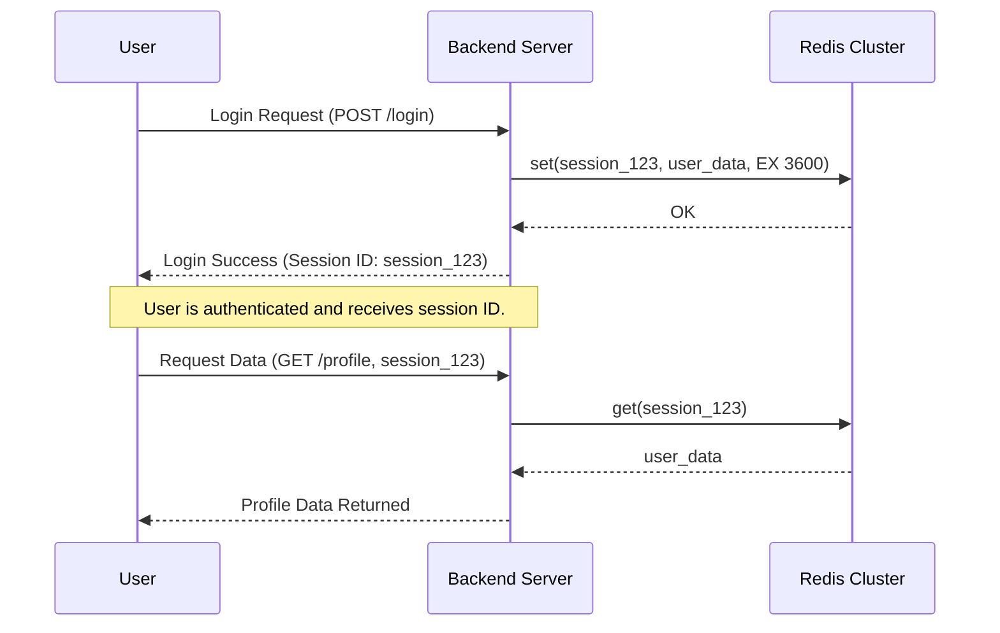
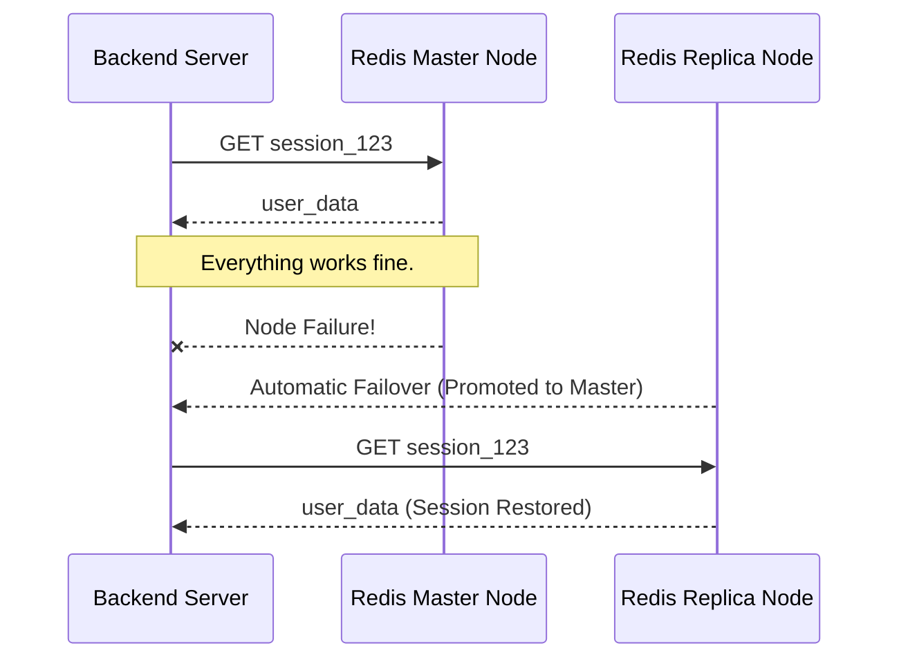

# 🗺️ 1.2.3. Redis for Backend Session Caching

## 📌 **What is Redis Session Caching?**

Redis is widely used for **session caching** in distributed applications because of its:

- ⚡ **Ultra-low latency** (sub-millisecond reads/writes).
- 🔄 **Data persistence support** (unlike Memcached).
- 🛠️ **Rich data structures** (e.g., Hashes for efficient session storage).
- 🔁 **Replication & clustering** (for high availability).

✅ **Why Use Redis for Session Storage?**

- 🚀 **Fast access** → Keeps session data in memory.
- 🔄 **Stateless backend** → Any backend server can access the same session.
- ♻ **Automatic expiration** → TTL ensures old sessions are removed.
- 🔒 **Persistence options** → Ensures sessions survive Redis restarts.

---

## 🔍 **How Redis Handles Session Mapping in a Distributed Cluster**

Unlike Memcached, **Redis supports native clustering and replication**, which makes it handle session mapping more effectively.

🔹 **In a Redis cluster:**

- **Data is automatically partitioned across multiple nodes**.
- **Each key (session) is assigned to a specific shard using hash slots**.
- **Clients send requests to the correct Redis node** using built-in cluster logic.

✅ **Redis solves the session mapping problem using:**

- 1️⃣ **Consistent Hashing & Hash Slots** → Ensures session keys always map to the correct node.
- 2️⃣ **Automatic Failover & Replication** → Ensures high availability.
- 3️⃣ **Persistence (RDB/AOF)** → Sessions persist even after crashes.

---

## 🏗 **How Redis Maps Sessions in a Cluster**

Redis **distributes keys** (sessions) using **hash slots**.  
Each session key is mapped to a specific node based on **CRC16 Hashing**.

### 🔹 **How Hash Slots Work**

- The cluster has **16,384 hash slots** (predefined).
- **Each node in the cluster owns a range of slots** (e.g., `Node A: 0-5461`, `Node B: 5462-10922`, etc.).
- **Redis hashes the session key** and assigns it to a slot → The session is stored in the corresponding node.
- When scaling (adding/removing nodes), Redis **rebalances slots automatically**.

---

## 🛠 **Session Mapping with Redis Cluster**

### 🔄 **Session Write Workflow**

- 1️⃣ **User logs in** → Backend generates `session_id = user_123`.
- 2️⃣ **Backend hashes `session_id`** → Determines correct Redis node.
- 3️⃣ **Redis stores session data in the assigned node’s slot**.
- 4️⃣ **Session TTL is set** to expire after inactivity.

### 🔄 **Session Read Workflow**

- 1️⃣ **User makes a request** with `session_id = user_123`.
- 2️⃣ **Backend hashes `session_id`** → Finds corresponding Redis node.
- 3️⃣ **Backend queries Redis for session data**.
- 4️⃣ **Redis returns session data instantly**.

---

## 🔄 **Session Storage Workflow (Mermaid Sequence Diagram)**

### **Scenario: A user logs in, and their session is stored in Redis.**



---

## 🔄 **How Redis Cluster Handles Scaling & Failover**

### ✅ **What Happens When a Node Fails?**

- If a **Redis node fails**, a **replica automatically takes over** (using Redis Sentinel).
- The backend client **does not need to change session mapping**.

### ✅ **What Happens When Nodes Are Added/Removed?**

- Redis **automatically rebalances hash slots** across nodes.
- **Minimal session loss** occurs since slots are only partially reassigned.
- Clients **auto-discover changes** using Redis cluster topology.

---

## 🔄 **How Redis Cluster Handles Session Failover (Mermaid Diagram)**



---

## 🛠 **Implementing Redis Session Caching in Code**

### ✅ **Storing a Session in Redis (Python Example)**

```python
import redis

# Connect to Redis Cluster
redis_client = redis.StrictRedis(host='my-redis-cluster', port=6379, decode_responses=True)

# Store a session (hashed and mapped automatically)
session_id = "session:USER_123"
session_data = {"user_id": "USER_123", "role": "admin"}

# Set session with TTL (3600 seconds)
redis_client.setex(session_id, 3600, str(session_data))

# Retrieve session data
stored_session = redis_client.get(session_id)
print(stored_session)
```

---

## 🛠 **Session Mapping Strategies in Redis**

### 🔹 **1️⃣ Hash-Based Partitioning (Sharded Redis)**

- **Each session key is mapped to a Redis node using hashing**.
- ✅ **Fast session retrieval**.
- ❌ **No automatic scaling** (must manage partitions manually).

### 🔹 **2️⃣ Redis Cluster (Recommended)**

- **Built-in hash slot partitioning**.
- **Automatic rebalancing when adding/removing nodes**.
- **Supports failover with replication**.

### 🔹 **3️⃣ Redis Sentinel (For Single Master Setup)**

- **Monitors Redis for failures** and promotes a replica.
- **Best for high availability in non-clustered Redis**.

---

## 🔥 **Best Practices for Redis Session Mapping**

- ✅ **Use Redis Cluster for scalable session caching**.
- ✅ **Enable Auto-Discovery in clients** (prevents hardcoding node addresses).
- ✅ **Use TTLs for session expiration** to avoid stale data.
- ✅ **Enable replication for high availability** (prevents session loss on node failure).
- ✅ **Monitor cache hit/miss rates in CloudWatch** to detect issues.

---

## 🎯 **Key Takeaways**

- ✔ **Redis stores session data efficiently using hash slots**.
- ✔ **Redis Cluster automatically distributes sessions across nodes**.
- ✔ **Session retrieval is fast and ensures scalability**.
- ✔ **Failover is handled automatically with Redis Sentinel/Replication**.
- ✔ **Session mapping remains consistent even when nodes are added/removed**.
