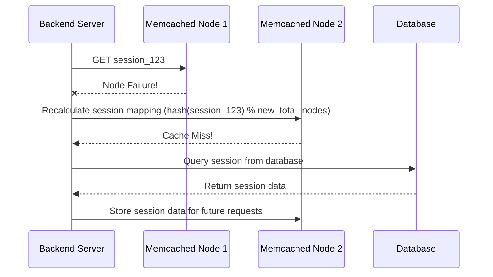
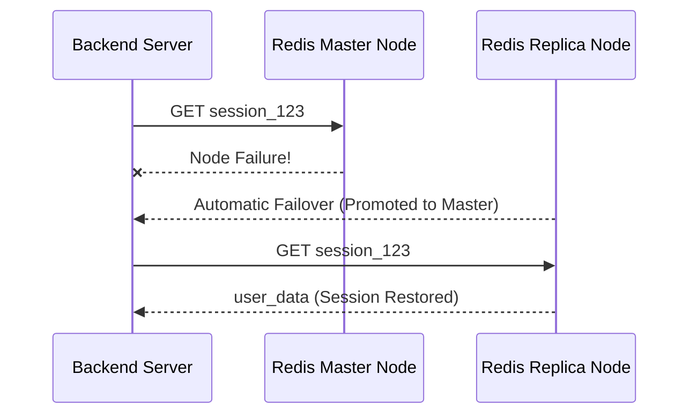

# ⚖️ **Redis 🆚 Memcached**

## 📌 **Introduction**

Redis and Memcached are both **in-memory caching** solutions used to **speed up applications** by reducing database queries. However, they differ in **features, persistence, replication, and scalability**.

In this guide, we’ll compare Redis and Memcached based on **core differences** and real-world use cases.

---

## 🏗 **1. Architecture & Data Model**

| Feature               | **Redis** 🟢                                                                                      | **Memcached** 🔴                                |
| --------------------- | ------------------------------------------------------------------------------------------------- | ----------------------------------------------- |
| **Data Structure**    | Supports **strings, lists, sets, hashes, sorted sets, bitmaps, hyperloglogs, geospatial indexes** | Simple **key-value pairs** only                 |
| **Memory Management** | Uses **internal memory-efficient encoding techniques**                                            | Uses **slab allocation** to avoid fragmentation |
| **Multi-threading**   | ❌ No (Single-threaded but highly optimized)                                                      | ✅ Yes (Multi-threaded for read/writes)         |

🔹 **Redis is a data store with advanced structures**, while **Memcached is purely a key-value cache**.

---

## 💾 **2. Data Persistence & Durability**

| Feature                   | **Redis** 🟢                                            | **Memcached** 🔴                         |
| ------------------------- | ------------------------------------------------------- | ---------------------------------------- |
| **Data Persistence**      | ✅ Supports RDB (Snapshotting) & AOF (Append-only file) | ❌ No persistence (data lost on restart) |
| **Backup & Restore**      | ✅ Yes, can take snapshots & recover                    | ❌ No built-in backup                    |
| **Use as Primary Store?** | ✅ Yes (Can act as a database)                          | ❌ No (Cache only)                       |

🔹 **Redis can persist data**, making it usable as a **database**, while **Memcached is purely a cache**.

---

## 🔄 **3. Performance & Scalability**

| Feature               | **Redis** 🟢                                    | **Memcached** 🔴                                    |
| --------------------- | ----------------------------------------------- | --------------------------------------------------- |
| **Read Performance**  | ⚡ Ultra-fast (single-threaded with event loop) | ⚡ Faster (multi-threaded)                          |
| **Write Performance** | ✅ Fast but depends on persistence settings     | ✅ Very fast (no persistence overhead)              |
| **Auto-Scaling**      | ✅ Redis Cluster for sharding & scaling         | ❌ No built-in clustering (client manages sharding) |

🔹 **Memcached offers slightly better raw performance** due to **multi-threading**, but **Redis scales better** with **Redis Cluster**.

---

## 🔥 **4. Handling Failures & Replication**

| Feature                 | **Redis** 🟢                                        | **Memcached** 🔴         |
| ----------------------- | --------------------------------------------------- | ------------------------ |
| **Replication**         | ✅ Yes (Master-Replica, supports multiple replicas) | ❌ No replication        |
| **Failover**            | ✅ Automatic failover with Sentinel/Cluster         | ❌ No failover mechanism |
| **Data Loss on Crash?** | ❌ No (If persistence enabled)                      | ✅ Yes (Data is lost)    |

🔹 **Redis is designed for high availability**, while **Memcached relies on clients to handle failures manually**.

---

## 🔍 **5. Session Caching: What Happens When a Node Fails?**

### 🔥 **Memcached: No Built-in Failover, No Replication**

- **Memcached nodes do not communicate** with each other.
- If a node **fails**, session data on that node is **lost**.
- The **client must detect and remove failed nodes**, causing **cache misses**.

#### **Memcached Node Failure Workflow**

---

### ✅ **Redis: Built-in Replication & Failover**

- **Redis supports master-replica replication**.
- If a **primary node fails, a replica is promoted automatically** (Sentinel/Cluster).
- **Clients automatically switch to the new primary**, so **no session data is lost**.

#### **Redis Node Failure Workflow**

### 🛠 **Key Differences in Failure Handling**

- **Memcached loses session data if a node fails**.
- **Redis keeps session data intact via replication**.

---

## ⚡ **6. Best Use Cases**

| Use Case                     | **Redis** 🟢                   | **Memcached** 🔴                     |
| ---------------------------- | ------------------------------ | ------------------------------------ |
| **Session Caching**          | ✅ Yes (Resilient to failures) | ✅ Yes (But session loss on failure) |
| **Full Page Caching**        | ✅ Yes                         | ✅ Yes                               |
| **Message Queues**           | ✅ Yes (Pub/Sub)               | ❌ No                                |
| **Real-time Analytics**      | ✅ Yes (Sorted sets)           | ❌ No                                |
| **Gaming Leaderboards**      | ✅ Yes                         | ❌ No                                |
| **AI/ML Feature Stores**     | ✅ Yes                         | ❌ No                                |
| **High-Speed Lookup Tables** | ✅ Yes                         | ✅ Yes                               |

---

## 🏆 **Final Verdict: Redis vs. Memcached**

✅ **Use Memcached if:**  
✔ You need **a simple, fast, and multi-threaded cache**.  
✔ **Session loss is acceptable** in case of failures.  
✔ You do **not need persistence or replication**.

✅ **Use Redis if:**  
✔ You need **a cache with advanced data structures** (lists, sets, etc.).  
✔ **Data persistence, replication, and high availability are important**.  
✔ You need **Pub/Sub messaging or transactional operations**.

---

## 🎯 **Key Takeaways**

✔ **Memcached is simpler & faster** but **loses all data on failures**.  
✔ **Redis is more powerful**, with **persistence, replication, and clustering**.  
✔ **For session caching, Redis is the better choice** (automatic failover, replication).  
✔ **For pure key-value caching, Memcached is slightly faster** due to multi-threading.

🔥 **For high availability, failover protection, and durability → Use Redis!** 🚀
