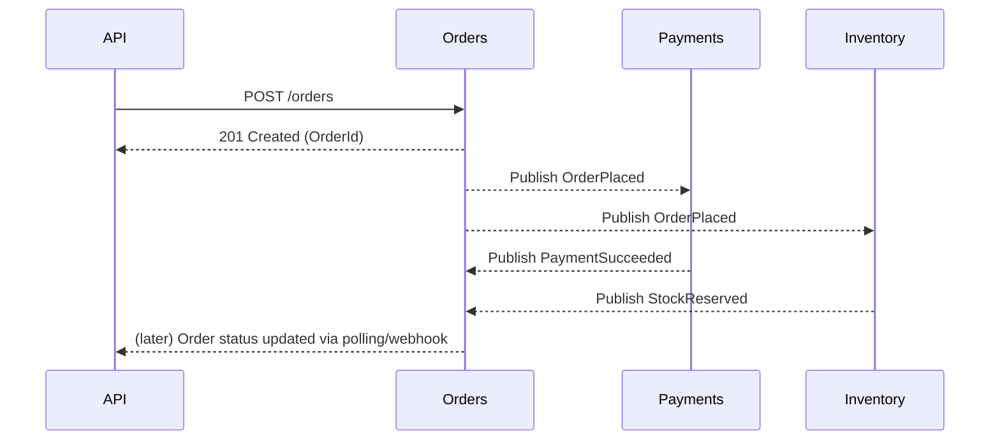
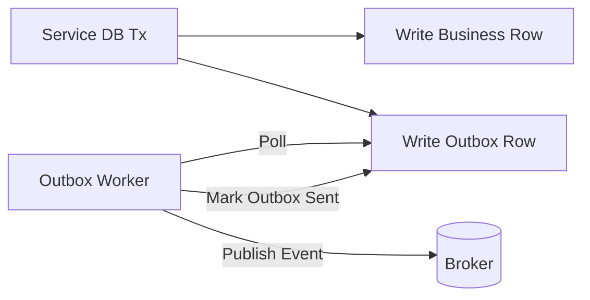
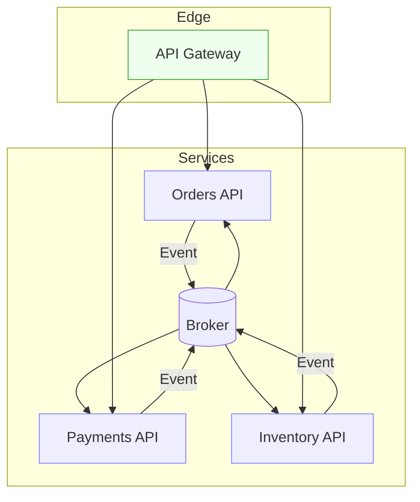

# 🧩 Microservices — Ultimate Exam Playbook (20 Qs · 25 min)

> Focus: architecture patterns, comms, data consistency, resilience, security, observability, deployment, testing, and .NET-specific tools. Expect scenario MCQs.

---

## 1) 🎯 First Principles & Vocabulary (they love these)

- **Microservice (official-ish):** independently deployable service owning a **bounded context** (DDD) with clear APIs.
- **Bounded Context:** the boundary where a domain model is valid (e.g., _Orders_, _Payments_).
- **Loose coupling / High cohesion:** each service does one thing well; minimal knowledge of others.
- **12-Factor & Cloud-Native:** stateless processes, config in env, disposability, automation.

**Monolith vs Microservices:**

| Dimension | Monolith 🏰    | Microservices 🧩   |
| --------- | -------------- | ------------------ |
| Deploy    | single unit    | per service        |
| Scale     | whole app      | hot path only      |
| Data      | shared DB      | **DB per service** |
| Coupling  | tight          | loose              |
| Failures  | cascade easily | isolated (ideally) |

**Exam picks:**

- Never share the **same DB** schema across services.
- Favor **asynchronous** for decoupling & resilience.
- “Distributed transaction” → **Saga**, not 2PC.

---

## 2) 🧭 Service Design & DDD

- Slice by **business capability**, not by technical layers.
- Avoid “nano-services” (too fine-grained).
- **Hexagonal (Ports & Adapters)** to isolate domain from infra.
- **API shape:** clean resources or clear RPCs; hide internal models with DTOs.

**If you see:** “Shared models/entities between services?” → ❌ (use contracts/DTOs and versioning).

---

## 3) 🔌 Communication Styles

### Synchronous

- **REST/HTTP**: human-friendly, ubiquitous; good for external APIs.
- **gRPC**: HTTP/2 + Protobuf; high-perf, streaming; great for service-to-service.

### Asynchronous (Event-Driven)

- **Brokers:** Kafka, RabbitMQ, Azure Service Bus, AWS SNS/SQS.
- **Use cases:** decoupling, buffering, eventual consistency, fan-out.

**Decision rule:**

- **User request needs immediate data** → Sync (often REST/gRPC).
- **Workflow chaining, decoupling, spikes** → Async events/queues.

**Mermaid: request → async workflow:**



---

## 4) 🗃 Data Per Service & Consistency

- **Own your data**: each service has its **own** DB (SQL/NoSQL) + schema.
- **Replication/duplication** is fine for **read models**.
- **Consistency model**: eventual across services, strong within a service.

### Patterns you must know

- **Saga** (distributed transaction):

  - **Orchestrator**: a central coordinator (explicit workflow).
  - **Choreography**: services react to events (no central brain).

- **Outbox**: write domain changes + **integration event** in same local transaction; a worker publishes from the outbox → guarantees “exactly-once _effect_”.
- **Inbox / Deduplication**: store processed message IDs to avoid reprocessing.
- **CQRS**: commands mutate write model; queries read optimized projections.
- **TCC (Try-Confirm/Cancel)**: reserve → confirm or cancel (payment/booking).

**If you see:**

- “How to avoid duplicate processing?” → **Idempotency** + **Outbox/Inbox** + **dedupe keys**.
- “Rollback across services?” → **Saga** (not 2PC).
- “High read throughput with complex joins?” → **CQRS + materialized views**.

**Mermaid: Outbox:**



---

## 5) 💥 Resilience & Reliability

- **Timeouts** everywhere (client/server).
- **Retries with backoff + jitter** (beware non-idempotent ops).
- **Circuit breaker** (open → fail fast; half-open test; close on success).
- **Bulkhead** (isolate pools/queues).
- **Load shedding & backpressure** (reject early under stress).
- **Hedging** (duplicate slow requests; careful with side effects).

**.NET (Polly) snippet:**

```csharp
services.AddHttpClient<PaymentsClient>()
    .AddTransientHttpErrorPolicy(p => p.WaitAndRetryAsync(new[]
    { TimeSpan.FromMilliseconds(100), TimeSpan.FromMilliseconds(300), TimeSpan.FromMilliseconds(800) }))
    .AddTransientHttpErrorPolicy(p => p.CircuitBreakerAsync(5, TimeSpan.FromSeconds(30)))
    .SetHandlerLifetime(TimeSpan.FromMinutes(5));
```

**Exam traps:**

- Retry **POST** without idempotency key ⇒ duplicates ❌
- Circuit breakers around **fast failing** dependencies ⇒ ✅

---

## 6) 🧷 Idempotency & De-Duping

- **Idempotency-Key** header for POST (e.g., payments).
- Server stores result keyed by (key + request hash) and returns same response on retry.
- Use **ETag + If-Match** for updates (optimistic concurrency).
- **Exactly-once delivery** is a myth; aim for **at-least-once + idempotent handlers**.

---

## 7) 🌀 Versioning & Schema Evolution

- **API versioning**: URL (`/v1`), header, or media type. Keep old versions running.
- **Message versioning**: Protobuf/Avro with backward compatibility, Schema Registry.
- **DB migrations**: **expand/contract** (add nullable column → write both → switch reads → drop old).

**If you see:** breaking a field type clients rely on → ❌ (add new field; deprecate old).

---

## 8) 🛡 Security (Zero-Trust FTW)

- **AuthN**: OAuth2/OIDC; user tokens at edge; **service-to-service** via mTLS or service credentials.
- **AuthZ**: role/scope/attribute policies; sometimes **OPA/ABAC**.
- **Transport**: TLS everywhere; HTTPS only; rotate certs/keys.
- **JWT pitfalls**: alg=none ❌, clock skew, long TTLs. Validate `iss`, `aud`, `exp`, `nbf`, `kid`.
- **Gateway** centralizes: authN, rate limit, WAF, request validation.
- **Secrets**: use vaults (Azure Key Vault, AWS Secrets Manager, Vault).
- **OWASP API Top**: broken auth, excessive data exposure, injection, rate limits.

**.NET (JWT bearer at edge):**

```csharp
services.AddAuthentication("Bearer").AddJwtBearer("Bearer", o =>
{
    o.Authority = "https://idp.example.com";
    o.Audience = "orders-api";
    o.TokenValidationParameters.ClockSkew = TimeSpan.FromMinutes(2);
});
```

---

## 9) 🧰 API Gateway & Service Discovery

- **Gateway (edge):** routing, TLS termination, auth, rate limiting, caching, request shaping, canaries.

  - .NET: **YARP** (reverse proxy), **Ocelot**. Cloud: APIM/API Gateway/Kong/NGINX.

- **Discovery:** Consul, Eureka, or **Kubernetes DNS**/service mesh (Istio/Linkerd).
- **GraphQL at the edge**: federation for many backends; beware N+1 and auth consistency.

**If you see:** “Where to put rate limiting?” → **Gateway**.

---

## 10) 👀 Observability (Logs, Metrics, Traces)

- **Structured logs (JSON)** + correlation IDs; enrich context (userId, orderId).
- **Metrics:** RED (Rate, Errors, Duration) for services; USE (Utilization, Saturation, Errors) for resources.
- **Tracing:** W3C Trace-Context (`traceparent`), **OpenTelemetry** → Jaeger/Zipkin/App Insights.
- **SLO/SLI** + error budgets (SRE concepts).

**.NET (OpenTelemetry):**

```csharp
services.AddOpenTelemetry()
  .WithTracing(b => b.AddAspNetCoreInstrumentation()
                     .AddHttpClientInstrumentation()
                     .AddSqlClientInstrumentation()
                     .AddOtlpExporter());
```

---

## 11) 🚢 Deployment, Containers & K8s

- **Docker**: small images, non-root, healthcheck.
- **Kubernetes**:

  - **Deployment** (replicas, rolling), **Service** (ClusterIP), **Ingress** (edge).
  - **Probes**: liveness (kill), readiness (remove from traffic), startup.
  - **HPA/KEDA**: scale on CPU/RAM or queue length.
  - **PDB** & **pod anti-affinity** for availability.

- **Service Mesh**: mTLS, retries, timeouts, traffic shaping **without code** (Envoy/Istio/Linkerd).
- **Dapr**: sidecar building blocks (pub/sub, state, bindings, secrets) for polyglot microservices.

**Release strategies:** blue/green, canary, feature flags; A/B at edge.

---

## 12) 🧪 Testing Strategy (super exam-able)

- **Unit tests**: domain logic.
- **Component/Integration**: service + DB/broker (use Testcontainers).
- **Contract tests**: **Consumer-Driven Contracts** (Pact) to prevent breaking clients.
- **End-to-end**: critical journeys only (expensive).
- **Chaos testing**: kill pods, inject latency (Gremlin, Chaos Mesh).

**If you see:** “Guarantee provider doesn’t break consumers?” → **CDC (Pact)**.

---

## 13) ⚙️ Performance & Caching

- **Vertical vs Horizontal** scaling; prefer horizontal in microservices.
- **Cache**: local, distributed (Redis).
- **Patterns**: cache-aside (most common), write-through, write-behind.
- **Invalidation**: event-driven (publish “ProductPriceChanged”).
- **Queue-based load leveling** for spikes.

---

## 14) ❌ Classic Anti-Patterns

- Shared DB between services.
- Too many sync calls in a chain (chatty mesh).
- Missing timeouts/circuit breakers.
- Central “god” schema and forced synchronous validation.
- Over-engineering (mesh + gateway + Dapr + … for a simple system).

---

## 15) 🧱 .NET Microservices Toolkit (what to name-drop)

- **ASP.NET Core** (REST), **gRPC** (internal).
- **HttpClientFactory + Polly** (resilience).
- **MassTransit / NServiceBus** (messaging).
- **YARP / Ocelot** (gateway).
- **Serilog + Seq/ELK**, **OpenTelemetry** (obs).
- **EF Core** (+ outbox with transactional publisher).
- **HealthChecks** & HealthChecks.UI.
- **Dapr** (pub/sub, secrets).
- **Pact-Net** (CDC), **Testcontainers** for integration tests.

---

## 16) 💻 Tiny Code Nuggets You Can Recall Fast

**(a) Publish/Consume (MassTransit):**

```csharp
// Publish an integration event
await _publishEndpoint.Publish(new OrderPlaced { OrderId = id, Amount = total });

// Consumer
public class PaymentSucceededConsumer : IConsumer<PaymentSucceeded>
{
  public async Task Consume(ConsumeContext<PaymentSucceeded> ctx)
  {
    // idempotent handler: check Inbox table for ctx.MessageId before applying
  }
}
```

**(b) Outbox Worker (sketch):**

```csharp
public class OutboxPublisher : BackgroundService
{
  protected override async Task ExecuteAsync(CancellationToken ct)
  {
    while (!ct.IsCancellationRequested)
    {
      var events = await db.Outbox.Where(e => !e.Sent).Take(100).ToListAsync(ct);
      foreach (var e in events) { await bus.Publish(e.AsIntegrationEvent(), ct); e.Sent = true; }
      await db.SaveChangesAsync(ct);
      await Task.Delay(500, ct);
    }
  }
}
```

**(c) gRPC service proto (fast internal RPC):**

```proto
service Inventory {
  rpc Reserve(ReserveRequest) returns (ReserveReply) {}
}
```

**(d) Health checks:**

```csharp
services.AddHealthChecks()
  .AddSqlServer(conn, tags: new[] {"ready"})
  .AddCheck("self", () => HealthCheckResult.Healthy(), tags: new[] {"live"});
app.MapHealthChecks("/health/live",  new HealthCheckOptions{ Predicate = r => r.Tags.Contains("live") });
app.MapHealthChecks("/health/ready", new HealthCheckOptions{ Predicate = r => r.Tags.Contains("ready") });
```

---

## 17) 🧠 “If you see X ⇒ pick Y” (Exam Traps)

- **Need to coordinate payment + inventory across services** ⇒ **Saga** (orchestration/choreography).
- **Prevent double-charge on retry** ⇒ **Idempotency-Key** + dedupe store.
- **Clients break after API change** ⇒ use **versioning** + maintain backward compatibility.
- **Traffic spikes overwhelm backend** ⇒ **queue-based load leveling** + **HPA/KEDA**.
- **Investigate slow request across 5 services** ⇒ **Distributed tracing** + correlation IDs.
- **Avoid cascading timeouts** ⇒ **timeouts + circuit breakers + bulkheads**.
- **Guarantee message processing once** ⇒ **at-least-once + idempotent** handler + **inbox**.
- **Strong contracts & low latency internal comms** ⇒ **gRPC**.
- **Where to put rate limiting/auth** ⇒ **API Gateway**.
- **How to roll out safely** ⇒ **Blue/Green** or **Canary**.

---

## 18) 📝 Mock Qs (30 quick hits + crisp answers)

1. DB per service benefit? → Loose coupling, autonomy.
2. Distributed transaction pattern? → **Saga**.
3. Prevent duplicate POST? → **Idempotency-Key**.
4. Best internal comms for speed/contract? → **gRPC**.
5. Guarantee clients don’t break after change? → **Consumer-Driven Contracts**.
6. Where to enforce throttling? → **API Gateway**.
7. Debug cross-service latency? → **Distributed tracing (OpenTelemetry)**.
8. Eventual vs strong consistency? → Cross-service = **eventual**.
9. Retry strategy good practice? → **Exponential backoff + jitter**; **idempotent** ops only.
10. Circuit breaker states? → Closed → Open → Half-Open → Closed.
11. CQRS goal? → Scale reads + simplify models.
12. Cache pattern default? → **Cache-aside**.
13. Ordering in Kafka? → Per **partition** only; design keys.
14. schema evolution best practice? → Backward compatible messages; **Schema Registry**.
15. “Exactly-once” messaging? → Myth; use **outbox/inbox + idempotent**.
16. Long-running workflow updates? → **Saga** + events.
17. Where to store secrets? → **Vault/Key Vault/Secrets Manager**.
18. Health endpoints? → **/health/live** (liveness), **/health/ready** (readiness).
19. Avoid chatty calls? → **Aggregate** or **Async events**; **GraphQL** at edge maybe.
20. Blue/green key advantage? → Instant rollback.
21. Bulkhead purpose? → Resource isolation (limit blast radius).
22. Backpressure example? → **Return 429**, drop load, or queue.
23. Tenant isolation pattern? → DB per tenant / schema per tenant (context-dependent).
24. Ensure DB change doesn’t break rollout? → **Expand/Contract** migration.
25. One service needs another’s data fast? → **Read replica/projection** (event-driven).
26. Validate JWT safely? → Validate `iss`,`aud`,`exp` and signature; no `alg=none`.
27. Make POST safe to retry? → **Idempotency key + dedupe**.
28. Failover on region outage? → **Multi-region** + async replication + DNS failover.
29. Internal auth between services? → **mTLS** or service credentials.
30. Observe saturation? → **USE metrics**; add **HPA**; **load shedding**.

---

## 19) 🧭 One-Page Visual Map (mental model)



- Edge: Auth, rate limit, canary.
- Services: own DB, publish/subscribe, sagas.
- Broker: decouple + backpressure.

---

## 20) ⚡ Last-Minute 2-Minute Drill

- **Saga, Outbox, Idempotency, Circuit Breaker, Gateway, Tracing** — say these out loud.
- **Timeouts everywhere.**
- **DB per service.**
- **Versioning + CDC tests.**
- **Async for decoupling; gRPC for speed.**
