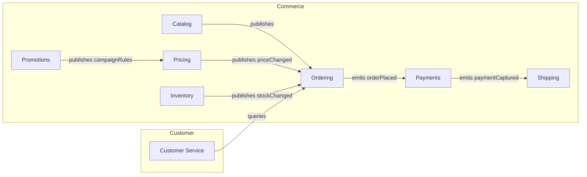

# 🧭 Service Boundaries & DDD — How to Split Microservices with Bounded Contexts

> Goal: learn to carve the system into the **right-sized services** that map to **business capabilities**, not tables or controllers. We’ll use **Domain-Driven Design (DDD)** to find **Bounded Contexts**, avoid chatty services, and keep data cleanly separated.

---

## 🧨 The Problem (Scenario-Driven)

**Scenario: “MegaShop”** (an e-commerce platform) starts as a clean monolith. Business grows, teams multiply, change requests flood in:

- **Promo logic** breaks **Pricing** whenever marketing experiments.
- **Inventory** recalculations slow down **Checkout**.
- **Returns/Refunds** touch Payments, which touches Orders, which touches Shipping… and deployments become scary.

Leads say: _“Let’s split into microservices!”_
Developers start cutting by **layers** (Controllers Service, Repos Service) or by **database tables** (OrderService owns Order table but still queries half the DB).
Result: **tightly coupled distributed monolith**—now you have network calls + coupling. Ouch.

**We need proper boundaries.** Enter **DDD**.

---

## 🧩 DDD Crash-Course (The Pieces You Actually Use)

- **Ubiquitous Language**: shared domain terms per business area; words mean exactly one thing within that area.
- **Bounded Context**: a **semantic boundary** where a specific model + language applies and is **internally consistent**.
- **Context Map**: relationships between contexts (e.g., CustomerService ↔️ OrderService).
- **Aggregates**: clusters of domain objects with an **Aggregate Root** guarding invariants (transaction boundary).

> Microservice rule of thumb: **one microservice ≈ one bounded context** (often, not always).

---

## 🗺️ Finding Boundaries: A Step-by-Step Field Guide

1. **Discover Capabilities (not data):**
   List business capabilities users care about:

   - Catalog, Pricing, Promotions, Inventory, Ordering, Payments, Shipping, Customer Service, Analytics.

2. **Language Test (Ubiquitous Language):**
   Do “Price”, “Discount”, “Offer” mean the **same thing** in Pricing vs Promotions? If not, they’re **different models** → separate contexts.

3. **Change-Rate & Ownership:**
   Who changes what most frequently? If Promotions changes weekly and Pricing monthly, **separate**—so one team can ship without blocking the other.

4. **Transaction Invariants:**
   Which rules must be **atomically** true? Those belong **inside one aggregate** (and usually one service). Cross-service, you’ll use **Sagas** (later).

5. **Data Independence:**
   Can a context own its data **without** live joins across services? If not, rethink the split or introduce **duplication via events**.

6. **Communication Pressure:**
   If two candidates would need **many synchronous calls** for a single UX action, consider merging them or making the interaction **event-driven**.

---

## 🧭 Example Context Map (MegaShop)



- **Catalog** owns product descriptors (name, images).
- **Pricing** owns price lists, taxes.
- **Promotions** owns campaign logic (coupons, rules).
- **Inventory** owns stock and reservations.
- **Ordering** owns cart → order lifecycle.
- **Payments** owns payment intents/captures.
- **Shipping** owns fulfillment.
- **Customer Service** reads across via **APIs** or **read models** (not DB joins).

---

## 🧱 Aggregates & Transaction Boundaries (C# Sketch)

**Ordering** keeps its **invariants** inside one aggregate:

```csharp
public sealed class Order : IAggregateRoot
{
    private readonly List<OrderLine> _lines = new();
    public OrderId Id { get; }
    public OrderStatus Status { get; private set; }
    public Money Total { get; private set; }

    public void AddLine(ProductId productId, int qty, Money unitPrice)
    {
        if (Status != OrderStatus.Draft) throw new DomainException("Cannot modify");
        _lines.Add(new OrderLine(productId, qty, unitPrice));
        RecalculateTotal();
    }

    public void Confirm()
    {
        if (!_lines.Any()) throw new DomainException("Empty order");
        Status = OrderStatus.Confirmed;
        // raise DomainEvent: OrderConfirmed
    }
}
```

- **Invariant**: You can’t confirm an empty order.
- **No cross-service validation here** (e.g., stock)—that’s **eventual** via **Inventory** events or a **Saga**.

---

## 🔗 Boundary Pitfalls & Fixes

| Pitfall                             | Smell                                     | Fix                                                    |
| ----------------------------------- | ----------------------------------------- | ------------------------------------------------------ |
| Split by layers (Controllers/Repos) | Services still share the same domain & DB | Split by **capability**/**language**                   |
| Shared database                     | Cross-service joins, lock contention      | **Database per service** + events for sync             |
| Chatty sync calls                   | Latency & tight coupling                  | Prefer **async events**; batch calls; reconsider split |
| “Price” means 3 things              | Endless translation bugs                  | Define **Ubiquitous Language per context**             |
| One service owns too much           | “God service” blocking everyone           | Carve by **change rate** and **team ownership**        |

---

## 🧪 Quick Boundary Heuristics (Interview-Ready)

- **Same change cadence?** Group together. Different? Split.
- **Needs atomic transactions together?** Same service/aggregate.
- **Different Ubiquitous Language?** Different bounded contexts.
- **Frequent synchronous chat?** Merge or switch to events.
- **Teams stepping on each other?** Split by ownership.

---

## 🎯 Problem → Boundary Decisions (Concrete)

**Problem:** Promo experiments break Pricing release.
**Decision:** **Promotions** separate from **Pricing**. Promotions emits `campaignRulesUpdated`; Pricing evaluates rules and emits `priceChanged`. Ordering only consumes **final price**.

**Problem:** Checkout blocks when Inventory recalculates.
**Decision:** **Inventory** separate. It publishes `stockChanged`; Ordering uses **reservation events** or an **Inventory-Reservation** workflow (Saga). Checkout reads a **denormalized availability** view.

**Problem:** Customer Service needs a full order timeline.
**Decision:** Build a **read model** (Materialized View) fed by events from Ordering/Payments/Shipping; no cross-DB queries.

---

## 🧰 Implementation Patterns that Enforce Boundaries

- **API per Service**, **DB per Service** (SQL or NoSQL fit for purpose).
- **Domain Events** internally; **Integration Events** externally.
- **Outbox Pattern** to reliably publish events with DB changes.
- **Schema Registry / Contracts** (e.g., JSON/Avro + versioning).
- **Consumer-Driven Contracts** to prevent breaking downstream.

---

## 🧑‍💻 .NET Tips (Practical)

- Separate projects: `Ordering.Domain`, `Ordering.Application`, `Ordering.Infrastructure`, `Ordering.Api`.
- Use **MediatR** for in-process domain events, then translate to **integration events** via an **Outbox** table + background publisher.
- Keep **DTOs per boundary**—never expose **Entity** types over the wire.
- Use **FluentValidation** inside a context; never query other services from within aggregates.

---

## ✅ Boundary Checklist (Print-Me)

- [ ] Capability-focused split (not tables/layers)
- [ ] Ubiquitous Language documented per context
- [ ] One **DB per service**; no cross-service joins
- [ ] Aggregates protect invariants; cross-context via **events/Sagas**
- [ ] Contracts versioned; **CDC/Outbox** for delivery guarantees
- [ ] Observability at the edge: correlation IDs, trace context
- [ ] Teams own contexts end-to-end (code, DB, pipeline)

---

## 🧠 Practice (Likely Assessment Questions)

1. **Define a Bounded Context** and how it maps to a microservice.
2. **Given a feature (e.g., “apply coupon at checkout”)**, which contexts are involved and why?
3. **Why database-per-service?** What breaks if you share a DB?
4. **How to handle an invariant spanning services** (e.g., payment + order confirmation)?
5. **Detect a bad boundary** from a diagram: what smells and how to fix?

---

## 📝 Mini Case Exercise (Try it fast)

> _“We’re adding Gift Cards. Marketing wants cards sold as products; Finance wants them treated as liabilities until redeemed.”_

- Do “gift card” mean the same in **Catalog** vs **Finance**? **No.**
- Create **GiftCard** context: issues, activates, redeems; exposes balance API; publishes `giftCardRedeemed`.
- **Ordering** treats gift card as a **payment method**, not a product discount. Clean boundary, different language.

---

## 🧩 One-Liner to Remember

> **Split by business language and invariants; glue with events—not joins.**
