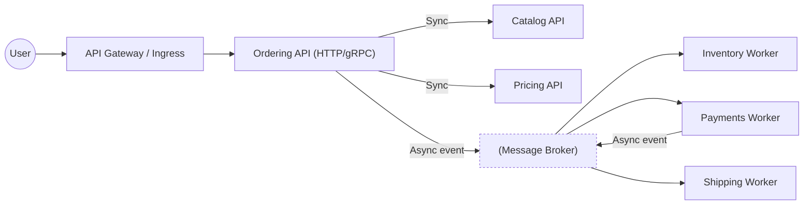
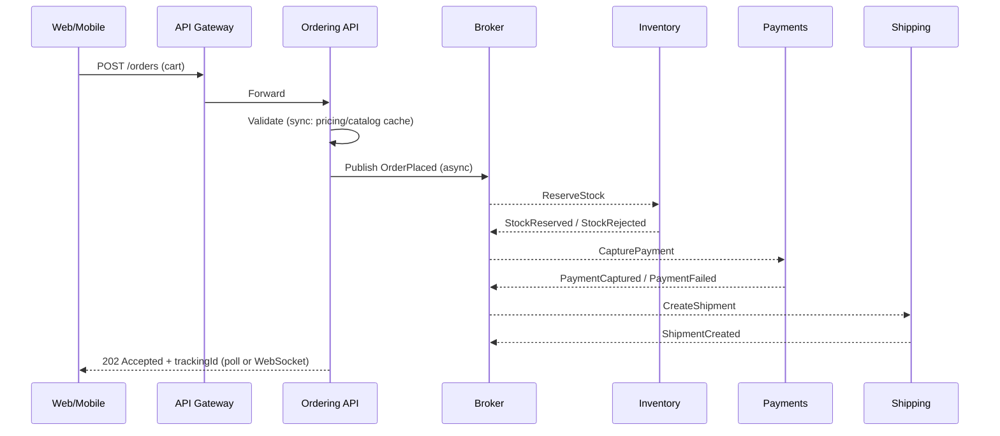

# 🔄 Communication in Microservices — The Big Picture (before we dive into parts)

> Goal: make services talk **clearly, reliably, and cheaply**—without coupling them into a distributed hairball.

We’ll anchor on **MegaShop** (e-commerce) and show when to use **synchronous** vs **asynchronous** communication, where **API Gateways** sit, and how **Service Discovery** keeps traffic flowing. Then we’ll deep-dive each part next.

---

## 🧠 The Mental Model

- **Synchronous (Sync)**: requester **waits** for a reply (HTTP/REST, gRPC).
  Great for **request/response** lookups, user-facing reads, immediate validations.

- **Asynchronous (Async)**: requester **doesn’t wait**; work happens later (events/queues).
  Great for **workflows, decoupling, retries, and scale smoothing**.

- **API Gateway**: the **front door**—routing, TLS, auth, quotas, aggregation.

- **Service Discovery**: the **phonebook**—how services find each other (DNS, Consul, Kubernetes).

---

## 🗺️ End-to-End View



- Reads/validations: **sync** to Catalog/Pricing.
- Business workflow: **async** via the **broker** (Inventory, Payments, Shipping).
- Gateway shields internals; discovery keeps addresses fresh.

---

## ⚖️ Choosing Sync vs Async (fast heuristic)

| Use Case                      | Prefer                    | Why                                                   |
| ----------------------------- | ------------------------- | ----------------------------------------------------- |
| Product detail page           | **Sync**                  | User needs immediate data (low latency)               |
| Price calculation             | **Sync** (read)           | Deterministic read; cacheable                         |
| Apply coupon at checkout      | **Sync** or **Async**     | If “must confirm now” → sync; else emit command/event |
| Reserve stock                 | **Async** (event/command) | Spikes, retries, idempotency                          |
| Send order confirmation email | **Async**                 | Non-critical side-effect                              |
| Payment capture               | **Async** (saga step)     | External gateway latency/failure                      |
| Cross-service propagation     | **Async events**          | Decoupling + eventual consistency                     |

> Rule of thumb: **User-facing reads & immediate choices → sync**.
> **Long-running / failure-prone / spiky work → async**.

---

## 🧩 Communication Building Blocks

### 1) Synchronous (HTTP/REST, gRPC)

- **Pros:** simple, debuggable, easy versioning, great for reads.
- **Cons:** tight coupling (availability/latency cascade), chatty calls.
- **.NET tips:**

  - Use **`HttpClientFactory` + Polly** (timeouts, retries, circuit breaker).
  - Prefer **gRPC** for internal service-to-service (schema, perf, streaming).

```csharp
builder.Services.AddHttpClient("catalog", c => c.BaseAddress = new Uri(cfg.CatalogUrl))
  .AddPolicyHandler(PollyPolicies.Timeout())
  .AddPolicyHandler(PollyPolicies.RetryJitter())
  .AddPolicyHandler(PollyPolicies.CircuitBreaker());
```

### 2) Asynchronous (Events, Queues, Streams)

- **Pros:** decoupled, resilient, smooths spikes, natural for **Sagas**.
- **Cons:** eventual consistency, harder debugging, ordering semantics.
- **Patterns:** **Event** (fact), **Command** (intent), **Outbox** (reliable publish), **Inbox** (dedupe), **Idempotency** (safe retries).
- **.NET tips:** Azure Service Bus / RabbitMQ with **MassTransit** or native SDK; persist **Outbox** with the same DB transaction as state change.

```csharp
// Pseudocode: save order + outbox message in same DB tx
using var tx = db.Database.BeginTransaction();
db.Orders.Add(order);
db.Outbox.Add(new OutboxMessage(orderPlacedEvent));
await db.SaveChangesAsync();
await tx.CommitAsync();
// background publisher reads Outbox and publishes to broker
```

### 3) API Gateway

- **Roles:** routing, TLS termination, **OAuth2/OIDC**, request throttling, response caching, header injection (trace/corr IDs), coarse API composition.
- **Anti-pattern:** packing business logic into the gateway (becomes a choke point).
- **Cloud:** Azure API Management / YARP / NGINX Ingress / Istio Gateway.

### 4) Service Discovery

- **Kubernetes:** DNS (`orders.default.svc.cluster.local`) + kube-service VIPs.
- **Outside K8s:** Consul/Eureka or cloud DNS (Private DNS zones).
- **Client vs Server side:**

  - **Server-side** (LB/Ingress) is simplest.
  - **Client-side** (gRPC + service resolver) adds smarts (retries, locality).

---

## 🧵 Workflow Example (Sync + Async Blend)



- UI gets **Accepted** quickly; status updates flow via events → read model / push notifications.

---

## 🧰 Cross-Cutting Communication Concerns

- **Contracts & Versioning:**

  - REST: path/accept-header versioning; add fields **backwards compatible**.
  - gRPC: Protobuf with **field numbers**; never reuse numbers.

- **Idempotency:**

  - For POST/commands, require `Idempotency-Key` or message `MessageId`.
  - Store processed keys to prevent duplicates on retry.

- **Time-Bound Calls:** **Timeouts** everywhere; set **budgets** (e.g., 250ms to Pricing).
- **Resilience Policies:** **Retry with jitter**, **circuit breaker**, **bulkhead** (concurrency limits).
- **Backpressure:**

  - Queues with **max delivery** & **dead-letter**;
  - HTTP: **429** + `Retry-After`; use **token buckets** in gateway.

- **Observability:**

  - **Correlation/Trace IDs**: propagate `traceparent` (W3C) and `X-Correlation-Id`.
  - **Structured logs** with span/trace IDs; OpenTelemetry for traces/metrics.

- **Security:**

  - At the edge: **OAuth2/OIDC** (user-to-service).
  - Service-to-service: **mTLS** or **JWTs** with short TTL, audience checks.

---

## 🚨 Common Anti-Patterns (and fixes)

| Anti-Pattern                            | Pain                            | Fix                                                          |
| --------------------------------------- | ------------------------------- | ------------------------------------------------------------ |
| Chatty sync calls (N+1 across services) | Latency & fragility             | Compose via gateway or **denormalized read models**          |
| Shared DB to “avoid APIs”               | Tight coupling, lock contention | **API + events**; DB per service                             |
| Fire-and-forget without DLQ             | Lost work                       | Broker with **DLQ**, retries, poison-message handling        |
| Gateway as business brain               | Single point of failure         | Keep gateway **thin**; business logic in services            |
| No versioning strategy                  | Breaking clients                | **SemVer** contracts, additive changes, deprecate gracefully |

---

## 🧪 .NET / K8s Practical Defaults

- **Sync:** `HttpClientFactory` + Polly; gRPC for internal S2S; **JSON** with consistent casing.
- **Async:** Azure Service Bus (queues/topics) or RabbitMQ; **MassTransit** for consistency.
- **Gateway:** Azure API Management or **YARP** as edge proxy; rate limiting.
- **Discovery:** K8s services (DNS); readiness probes to keep bad pods out.
- **Tracing:** OpenTelemetry SDK → Azure Monitor / Jaeger; propagate headers in middleware.

```csharp
app.Use(async (ctx, next) => {
  // Correlation ID middleware (simplified)
  var cid = ctx.Request.Headers.TryGetValue("X-Correlation-Id", out var v)
              ? v.ToString()
              : Guid.NewGuid().ToString();
  ctx.Response.Headers["X-Correlation-Id"] = cid;
  using (LogContext.PushProperty("CorrelationId", cid))
    await next();
});
```

---

## 📝 What interview/assessments love to ask

1. **When would you choose events over REST?** (spikes, decoupling, eventual consistency acceptable)
2. **How do you make sync calls resilient?** (timeouts, retries w/ jitter, circuit breaker, bulkheads)
3. **What is an API Gateway vs Service Mesh?** (gateway = edge; mesh = S2S L7 features, mTLS, retries)
4. **How do you ensure idempotency on retries?** (idempotency keys/inbox table)
5. **How do you debug an event-driven flow?** (trace IDs across logs + spans, DLQ inspection, replay)

---

## ✅ Pocket Checklist

- [ ] Pick **sync** for immediate reads/UX; **async** for workflows & side-effects
- [ ] Standardize contracts & versioning; backwards-compatible changes
- [ ] Enforce **timeouts, retries, circuit breakers, bulkheads**
- [ ] **DB per service**; use events for propagation; Outbox/Inbox for reliability
- [ ] **Gateway** handles routing/auth/quotas; keep it thin
- [ ] **Discovery** via K8s DNS or registry; health probes in place
- [ ] **Trace & correlate** every call; DLQs + replay tooling

---

> **One-liner to remember:** _Use sync to answer now, async to evolve safely; protect edges with a gateway and let discovery + policies keep the system alive._
