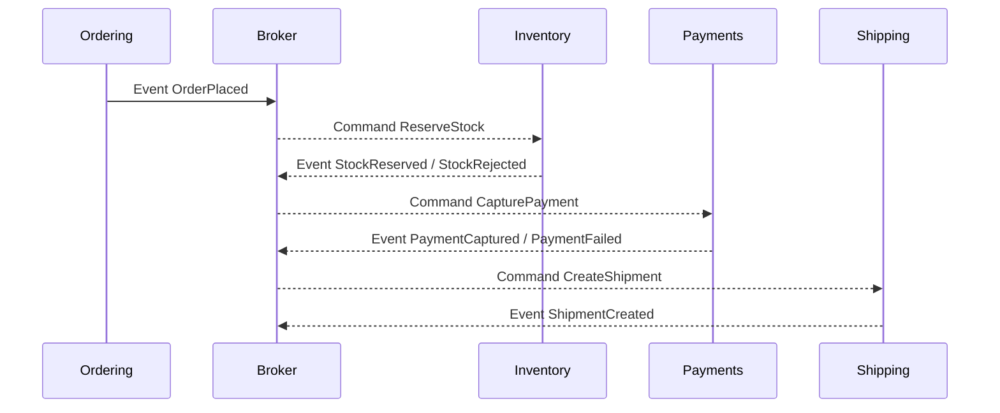

# 📬 Async Communication — Events, Brokers, and Decoupling (clear, .NET-first)

> Goal: make services **independent and resilient** by replacing tight, request/response coupling with **messages** and **events**. Async buys you **decoupling, elasticity, retries, and smoother spikes**—at the cost of **eventual consistency** and more careful design.

---

## 🧠 When to go Async (fast rule)

- **Spiky or slow work** (payments, emails, PDFs, ML jobs)
- **Cross-service propagation** (order → inventory → shipping)
- **Side-effects** that shouldn’t block the user response
- **Long-running workflows** (multi-step, compensations)

> UX trick: respond **202 Accepted** quickly, then push status changes via notifications or a **read model** fueled by events.

---

## 🧩 Message Types (don’t mix them up)

- **Event (Fact):** “_OrderPlaced_” — already happened; **fan-out** to whoever cares.
- **Command (Intent):** “_ReserveStock_” — asking a specific service to do something **exactly once logically** (idempotently).
- **Query (Ask):** usually sync; **don’t** use events for queries.

**Scopes:**

- **Domain Event:** inside a bounded context (in-process or local bus).
- **Integration Event:** leaves the service boundary (public contract, versioned).

---

## 🚚 Delivery Semantics (reality check)

- **At-most-once:** no retries → may **lose** messages (rarely acceptable).
- **At-least-once (default):** retries → **duplicates possible** → **idempotent handlers required**.
- **Exactly-once:** a myth across networks; emulate with **Outbox + Inbox + Idempotency**.

---

## 🔁 Reliability Patterns You’ll Name in Interviews

### 1) **Transactional Outbox** (publish reliably)

Save state change **and** the “to-publish” record in **the same DB transaction**. A background publisher ships the message to the broker.

```csharp
// Within Ordering service (EF Core)
using var tx = await db.Database.BeginTransactionAsync();

db.Orders.Add(order);                       // state change
db.Outbox.Add(new OutboxMessage {
  Type = "OrderPlaced",
  Payload = JsonSerializer.Serialize(new { order.Id, order.Total }),
  CorrelationId = correlationId
});

await db.SaveChangesAsync();
await tx.CommitAsync();

// Background service (single responsibility)
foreach (var m in await db.Outbox.UnpublishedAsync())
{
  await _bus.Publish(m.Type, m.Payload, m.CorrelationId);  // to broker
  m.MarkPublished();
}
await db.SaveChangesAsync();
```

### 2) **Inbox / Deduplication** (process safely)

Consumers persist a `(MessageId, Handler)` record **before** executing. If seen again → **skip**.

```csharp
if (await inbox.SeenAsync(msg.Id, "ReserveStockHandler")) return;
// handle; then inbox.RecordProcessed(msg.Id, "ReserveStockHandler");
```

### 3) **Idempotency**

- Use a **business key** (`OrderId`, `PaymentIntentId`) so reprocessing yields the **same end state**.
- For POST-like commands, require an **Idempotency-Key**.

### 4) **Retries, Backoff, DLQ**

- Retry transient failures with **exponential backoff + jitter**.
- After N attempts, send to **Dead Letter Queue** (DLQ) with reason; alert + manual/automatic replay.

---

## 🕸️ Workflow: Choreography vs Orchestration



- **Choreography (events drive next steps):** simple, decoupled; can get implicit/complex.
- **Orchestration (Saga orchestrator issues commands):** explicit flow; one place to see the process.
  _Both need compensations_ (e.g., if payment fails, emit **OrderCanceled** to undo reservations).

---

## 🧱 Ordering, Partitioning, and Keys

- **Key by aggregate** (`OrderId`, `CustomerId`) so all messages for that entity land on the **same partition/session** → **ordered** per key.
- Design handlers to **not rely** on global ordering.

---

## 🛠️ .NET Implementations (two realistic paths)

### A) **MassTransit** (quick start, strong patterns out-of-the-box)

**Publish & consume with Azure Service Bus (or RabbitMQ):**

```csharp
// Program.cs
builder.Services.AddMassTransit(x =>
{
    x.SetKebabCaseEndpointNameFormatter();
    x.AddConsumer<ReserveStockConsumer>(cfg => cfg.UseConcurrentMessageLimit(8));

    x.UsingAzureServiceBus((ctx, cfg) =>
    {
        cfg.Host(builder.Configuration["ASB:Connection"]);
        cfg.ConfigureEndpoints(ctx);
        cfg.UseMessageRetried(r => r.Exponential(5, TimeSpan.FromSeconds(1), TimeSpan.FromSeconds(30), TimeSpan.FromMilliseconds(200)));
        cfg.UseCircuitBreaker(cb => cb.TrackingPeriod = TimeSpan.FromMinutes(1));
        cfg.UseInMemoryOutbox(); // app-level outbox (or implement DB outbox)
    });
});
```

```csharp
public record OrderPlaced(Guid OrderId, decimal Total, string CorrelationId);

public class ReserveStockConsumer : IConsumer<OrderPlaced>
{
    public async Task Consume(ConsumeContext<OrderPlaced> ctx)
    {
        // Inbox check (custom) here if needed
        await _inventory.ReserveAsync(ctx.Message.OrderId);
        await ctx.Publish(new StockReserved(ctx.Message.OrderId), x =>
            x.CorrelationId = Guid.Parse(ctx.Message.CorrelationId));
    }
}
```

### B) **Raw Azure Service Bus SDK** (fine-grained control)

```csharp
// Sender
await using var client = new ServiceBusClient(conn);
var sender = client.CreateSender("orders");
var msg = new ServiceBusMessage(JsonSerializer.Serialize(new { orderId }))
{
    MessageId = correlationId,                // for dedup
    CorrelationId = correlationId,
    Subject = "OrderPlaced",
};
await sender.SendMessageAsync(msg);

// Processor (consumer)
var processor = client.CreateProcessor("orders", new ServiceBusProcessorOptions {
    MaxConcurrentCalls = 8, AutoCompleteMessages = false
});
processor.ProcessMessageAsync += async args =>
{
    var body = args.Message.Body.ToString();
    // inbox.Dedupe(args.Message.MessageId)...
    await HandleAsync(body);
    await args.CompleteMessageAsync(args.Message);
};
processor.ProcessErrorAsync += e => { /* log & metrics */ return Task.CompletedTask; };
await processor.StartProcessingAsync();
```

---

## 🏗️ Brokers in practice (what to pick when)

| Broker                | Model                                      | Shines at                                                | Notes for .NET                                                                                      |
| --------------------- | ------------------------------------------ | -------------------------------------------------------- | --------------------------------------------------------------------------------------------------- |
| **Azure Service Bus** | Queues + Topics/Subscriptions              | Enterprise workflows, commands, pub/sub, DLQ, scheduling | **Sessions** for per-key ordering; transactions; great with MassTransit / native SDK                |
| **RabbitMQ**          | Exchanges + Queues (direct, topic, fanout) | Low-latency messaging, routing flexibility               | No built-in persistent log; use DLX for dead letters; MassTransit is excellent                      |
| **Kafka**             | Partitioned log + consumer groups          | High-throughput event streams, replays, event sourcing   | Ordered per partition; retention & replay; use Confluent .NET client; great for analytics/streaming |

**Heuristic:**

- Workflow + commands + enterprise integration → **Service Bus**
- Simple routing + OSS infra → **RabbitMQ**
- High-throughput streams, replay, analytics → **Kafka**

---

## 🧰 Contracts & Versioning (don’t break consumers)

- **JSON events:** include `type`, `version`, and **additive** fields only.
- **Protobuf/Avro:** evolve **additively**; never reuse field IDs.
- Keep **old consumers** working while new ones roll out; deprecate with telemetry.

**Example JSON payload:**

```json
{
  "type": "OrderPlaced",
  "version": 2,
  "orderId": "4b8f...",
  "total": 123.45,
  "currency": "USD",
  "occurredAt": "2025-08-22T12:34:56Z"
}
```

---

## 🕵️ Observability (how you debug async flows)

- **Correlation:** put `CorrelationId` on every message; propagate W3C `traceparent` in headers if your tooling supports it.
- **Tracing:** OpenTelemetry spans for **publish → process → publish**; visualize end-to-end in App Insights/Jaeger.
- **Metrics:** queue length, age, success/failure rate, retry counts, DLQ depth.
- **Logs:** structured; include `correlationId`, `messageId`, `type`, `attempt`, `handler`.

---

## 🛡️ Security & Governance

- **AuthN/Z to brokers** (SAS/KeyVault creds for Service Bus; user/pass or TLS for RabbitMQ; mTLS for Kafka).
- **PII:** prefer **not** to put raw PII in events; if you must, encrypt fields or store a tokenized reference.
- **Least privilege**: producers can only send to specific topics; consumers only read from assigned queues/subscriptions.

---

## 🚨 Common Anti-Patterns (and quick fixes)

| Anti-Pattern                      | Pain                 | Fix                                                      |
| --------------------------------- | -------------------- | -------------------------------------------------------- |
| Fire-and-forget with no DLQ       | Lost work            | Broker with **DLQ** + alerts, replay tool                |
| One giant “God Event”             | Tight coupling       | Multiple focused events, per-consumer contracts          |
| Relying on global ordering        | Flaky logic          | **Per-key** ordering + idempotent handlers               |
| Doing sync calls inside consumers | Hidden coupling      | Keep handlers **pure**, offload calls via separate steps |
| Shared DB to “avoid messaging”    | Tightly coupled data | **DB-per-service** + events for propagation              |

---

## 📝 Assessment-ready Q\&A (crisp)

- **Why async?** Decoupling, resilience, smoothing spikes, retries; accept **eventual consistency**.
- **How to ensure no duplicates?** You **can’t** at the wire; use **Inbox/Dedup + idempotent handlers**.
- **How do you not lose messages?** **Outbox** on publish, **DLQ** on consume, monitored & replayable.
- **Choreography vs orchestration?** Events chain steps vs a central saga; pick by complexity/visibility.
- **How to keep order?** Partition/session by **business key**; design without global ordering assumptions.

---

## ✅ Pocket Checklist

- [ ] Pick broker (Service Bus / RabbitMQ / Kafka) fit for the job
- [ ] **Outbox** on write; **Inbox** on consume; **Idempotency** everywhere
- [ ] Retries with backoff + **DLQ**; alert & replay path
- [ ] Partition by **aggregate key** for ordered processing
- [ ] Versioned, additive **contracts**; avoid PII in payloads
- [ ] Correlation IDs & traces; watch queue length/age metrics

---

> **One-liner to remember:** _Publish facts or commands, not hopes; guarantee delivery with Outbox/Inbox, and design handlers to be idempotent. The broker gives you retries—the patterns give you correctness._
