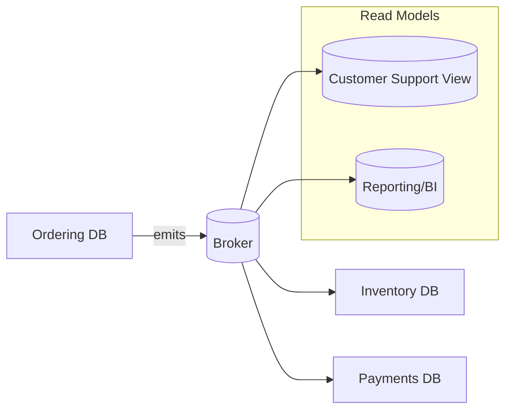

# 🥛 Database-Per-Service — The rule, the why, and the how

## 🎯 The Rule (one line)

**Each microservice owns its data store exclusively**—its **schema, read/write model, and storage tech**—and no other service reads/writes it directly.

---

## 🧨 The Problem (MegaShop story)

- Teams split `Ordering`, `Inventory`, `Payments` into “services” but keep **one shared SQL**.
- A quick “JOIN” across `Orders` and `Inventory` fixes a dashboard… until a migration for Inventory breaks Orders in prod.
- Deployments now require **global coordination**; one team’s change blocks everyone.

**Symptom checklist:** cross-service foreign keys, shared migrations, “just one small JOIN”, hotfixes that touch multiple “services”.
**Diagnosis:** You don’t have microservices—you have a distributed monolith.

---

## ✅ Why DB-per-service wins

- **Autonomy:** each service deploys and migrates independently.
- **Resilience:** blast radius is limited; one DB outage ≠ global outage.
- **Fit-for-purpose:** choose SQL for Orders, document DB for Catalog, time-series for Metrics.
- **Clear invariants:** true ACID rules exist **inside** a service boundary only.

---

## 🔒 What it forbids (and replacements)

| Forbidden                        | Why                                    | Do instead                                       |
| -------------------------------- | -------------------------------------- | ------------------------------------------------ |
| Cross-service SQL joins          | Tight coupling, locks, schema breakage | **API calls** or **materialized read models**    |
| Foreign keys across services     | Global transactions implied            | **Reference by ID**; validate via API/event      |
| Reading another service’s tables | Bypasses invariants/business rules     | **Subscribe to events**; build local projections |

---

## 🧩 How data flows without joins



- **Ordering** emits `OrderPlaced`, `OrderCompleted`.
- **Inventory** updates stock and emits `StockChanged`.
- **Read models** subscribe and build **denormalized** views for queries—no cross-service joins.

---

## 🛠️ .NET & EF Core: project layout and boundaries

```ini
Ordering.Domain/
Ordering.Application/
Ordering.Infrastructure/  <-- EF Core + Outbox
Ordering.Api/
```

**Separate DbContext per service:**

```csharp
public sealed class OrderingDbContext : DbContext
{
    public DbSet<Order> Orders => Set<Order>();
    public DbSet<OutboxMessage> Outbox => Set<OutboxMessage>();
    protected override void OnModelCreating(ModelBuilder b)
    {
        b.Entity<Order>().HasKey(x => x.Id);
        // no foreign keys to other services' aggregates
    }
}
```

**Writing state + staging an integration event (Outbox):**

```csharp
using var tx = await db.Database.BeginTransactionAsync();

var order = Order.Create(customerId, lines);
db.Orders.Add(order);

// stage integration event for publication
db.Outbox.Add(OutboxMessage.From("OrderPlaced", new {
    orderId = order.Id, total = order.Total, occurredAt = DateTime.UtcNow
}));

await db.SaveChangesAsync();
await tx.CommitAsync(); // state and outbox are atomic
```

A background **publisher** reads `Outbox` and publishes to the broker (Azure Service Bus / RabbitMQ / Kafka). Other services **do not** read `Ordering`’s DB—they react to events.

---

## 🧰 Building read models (queries without joins)

**Customer Support View** (separate DB) subscribes to events from Orders, Payments, Shipping to build a **timeline per order** it can query in one shot.

- Store shape optimized for queries (denormalized).
- Rebuildable by **replaying events** if needed.
- If a field is missing, **extend events additively** (versioning).

---

## 🧪 Referential integrity without foreign keys

- Use **identity by reference** (e.g., store `CustomerId` as a value, not FK).
- Validate references via **API call** (sync) or **eventual check** (async).
- For critical invariants spanning services, use a **Saga** (orchestrated process) instead of a global transaction.

---

## 🧯 Migrations & “expand/contract”

- **Never** make a breaking schema change in one shot.
- **Expand:** add new columns/tables first; write both old+new.
- **Dual write** during rollout; backfill data.
- **Contract:** once all consumers use the new shape (verified by telemetry), remove old columns.

---

## 🔍 Polyglot persistence (do it with intent)

- `Orders` → **SQL** (ACID, relational aggregates).
- `Catalog` → **NoSQL** (document, flexible attributes).
- `Search` → **Elasticsearch** (inverted index).
- Choose based on **access patterns**; events glue them.

---

## 🚨 Common mistakes (and fixes)

| Mistake                                     | Pain                            | Fix                                                           |
| ------------------------------------------- | ------------------------------- | ------------------------------------------------------------- |
| Shared “reference” tables (e.g., `Product`) | Tight coupling, deploy locks    | **Owner service** publishes events; others cache or project   |
| Reporting queries straight on OLTP DBs      | Locking, slow queries           | **ETL / stream** events into a **reporting store**            |
| One migration repo for all services         | Coordination hell               | Migrations **per service**, versioned with code               |
| Global unique constraints across services   | Hidden distributed transactions | Enforce **locally**; globally via **reservation IDs + Sagas** |

---

## 🧠 Assessment-ready answers (crisp)

- **Why DB-per-service?** Autonomy, resilience, fit-for-purpose, and clear invariants. Sharing DBs re-couples services and blocks independent deploys.
- **How do services get “joined” data?** They **don’t** join; they **subscribe to events** and build local **read models** or make **explicit APIs**.
- **How do you ensure no event loss?** **Transactional Outbox** on write, **retries + DLQ** on consume.
- **How do you evolve schemas safely?** **Expand/contract**, dual-write, telemetry to confirm adoption before contracting.
- **What about cross-service transactions?** Use **Sagas** (orchestrated or choreographed), not 2PC.

---

## ✅ Pocket checklist

- [ ] **Exclusive DB per service**; no cross-service joins/foreign keys
- [ ] **Outbox** for reliable event publish; **Inbox/Idempotency** on consume
- [ ] **Read models** for cross-data queries; rebuildable from events
- [ ] **Expand/contract** migrations with dual-write when needed
- [ ] **Telemetry** proves no consumers depend on old shapes before cleanup

---

> **One-liner to remember:** _Own your data locally, share facts via events, and query through projections—not joins._
