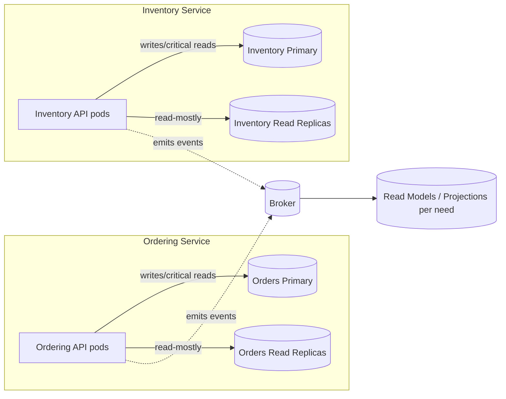

# 🔄 Read/Write Splits & Replicas — “Whole app DB” vs **Microservices**

**Short answer:** The “one write DB + many read replicas for the whole app” is a **monolithic database pattern**. In **microservices**, you still can (and often should) use **read/write splitting**, but you do it **per service’s own database**, not one shared cluster for everyone.

---

## 🧭 Why a single global primary+replicas is **not** microservices

| Problem if all services share one DB/replicas | Why it hurts                                                                              |
| --------------------------------------------- | ----------------------------------------------------------------------------------------- |
| **Coupling & coordination**                   | A schema change for Inventory risks breaking Orders/Payments; independent deploys vanish. |
| **Blast radius**                              | Primary outage = **entire platform** down.                                                |
| **Performance interference**                  | One service’s heavy reads consume replica bandwidth, starving others.                     |
| **Hidden joins**                              | Teams “just join a table” → you’ve rebuilt a distributed monolith.                        |
| **Scaling mismatch**                          | Catalog read traffic ≫ Payments write traffic—but everyone scales the same DB tier.       |

**Microservices rule:** **DB-per-service.** If you want read replicas, you attach them **to that service’s DB only**.

---

## ✅ Microservices-friendly pattern



- Each service owns **its** primary + optional replicas.
- Cross-service data flows via **events** and **read models**, not joins.

---

## 🔗 “Relations” & joins in this world

- **Inside one service** (same DB): use normal **FKs, joins, transactions**.
- **Across services**: store **foreign IDs** (no FK), and either:

  - call the other service **synchronously** for validation (sparingly), or
  - keep a **projection** updated by events (preferred for read paths).

- For stable views (e.g., price at purchase), **snapshot** fields into your own tables at write time.

---

## 📖 Read replicas with **eventual consistency** — how to live with it

Read replicas lag behind the primary by milliseconds→seconds. Tactics:

1. **Read-your-write** when needed: route those requests to the **primary**.
2. **Session pinning**: after a write, mark the user/session to use primary for N seconds.
3. **LSN/Change version check** (advanced): include the commit version (LSN/timestamp) in the response; the client sends it back and the API waits/reads from primary until replicas ≥ version.
4. **Fallback-on-miss**: if a fresh read can’t find the expected row on a replica, retry on **primary**.
5. **Cache & invalidate**: for hot keys, cache after write and serve until replicas catch up.

> Rule of thumb: **critical, immediate reads → primary**; **general reads → replicas**.

---

## 🧑‍💻 .NET ways to implement read/write splitting

### Option A — Two DbContexts (clear separation)

```csharp
builder.Services.AddDbContext<OrdersWriteDb>(o =>
    o.UseSqlServer(cfg.WriteConn, x => x.EnableRetryOnFailure()));

builder.Services.AddDbContextFactory<OrdersReadDb>(o =>
    o.UseSqlServer(cfg.ReadConn, x => x.EnableRetryOnFailure())
     .UseQueryTrackingBehavior(QueryTrackingBehavior.NoTracking));
```

```csharp
public class OrdersQueryService {
  private readonly IDbContextFactory<OrdersReadDb> _factory;
  public OrdersQueryService(IDbContextFactory<OrdersReadDb> factory) => _factory = factory;

  public async Task<OrderDto?> GetAsync(Guid id) {
    await using var db = await _factory.CreateDbContextAsync();
    return await db.Orders.AsNoTracking().Where(o => o.Id == id).Select(...).FirstOrDefaultAsync();
  }
}
```

### Option B — One context, connection routing

- Use a repository/Unit-of-Work that opens a **read** or **write** connection per operation.
- For Azure SQL: set `ApplicationIntent=ReadOnly` on the **read** connection string to hit readable secondaries.

```ini
# appsettings.json (examples)
"ConnectionStrings": {
  "OrdersWrite": "Server=...;Database=Orders;Encrypt=true;",
  "OrdersRead":  "Server=...;Database=Orders;Application Intent=ReadOnly;Encrypt=true;"
}
```

**Don’t forget:**

- Transient-fault handling (`EnableRetryOnFailure()`).
- Concurrency tokens (`rowversion`) to prevent lost updates.
- Query behavior `NoTracking` for reads (less overhead).

---

## 🧪 Where CQRS fits

- **CQRS inside a service**: separate **write model** (aggregate invariants) from **read model** (denormalized, replica-friendly).
- This is orthogonal to “replicas”; you can have CQRS on a single primary or on primary+replicas.

---

## 🌍 Multi-region notes (in case it comes up)

- Most relational setups are **single-writer** + geo-replicated **readers** → same rules: pin critical reads to the region’s writer.
- True multi-master systems exist (e.g., some NewSQL/NoSQL), but they trade off latency/conflict handling—rarely needed for typical microservice CRUD.

---

## ❌ When is a **shared** replica farm OK?

- For **analytics/BI** only: stream CDC/events into a **central warehouse** (Synapse/BigQuery/Databricks) and do big joins **there**.
- **Never** use a shared OLTP replica cluster as the runtime read DB for multiple services—it re-couples them.

---

## 📝 Crisp answers for the assessment

- **Is “1 write + many reads” the same in microservices?**
  **No** if it’s **one cluster for the whole app** (anti-pattern).
  **Yes** if it’s **per service** (good pattern).

- **How do multiple pods see consistent data?**
  They share the **same primary**; replicas are for **read-mostly**, with **read-your-write → primary** and **optimistic concurrency** to guard writes.

- **How do you do cross-service “joins”?**
  You **don’t**. Use **IDs**, **events**, and **projections/read models**.

- **How do you prevent duplicate effects with retries?**
  **Idempotency keys** + **unique constraints** + **Inbox/Outbox** patterns.

---

## ✅ Pocket checklist

- [ ] DB-per-service (primary + optional replicas)
- [ ] Intra-service joins allowed; inter-service joins forbidden
- [ ] Read-your-write routes to **primary**; general reads to **replicas**
- [ ] `rowversion` + retries (optimistic concurrency)
- [ ] Outbox/Inbox + idempotency; DLQ & replay
- [ ] Analytics/reporting done **outside** OLTP, not by sharing replicas

---

> **One-liner to remember:** _Use read replicas as an **internal optimization per service**, not a shared crutch across services. Join inside, publish facts outside._
