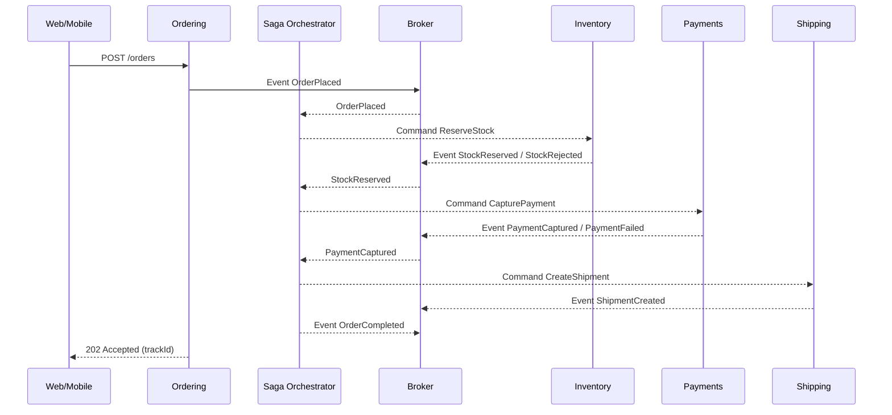

# ⏳ Eventual Consistency — Why “strong” consistency across services is rare (and how to make it safe)

> Core idea: Inside **one microservice**, you can have **ACID** and strong consistency. **Across** microservices, you almost never should—or can—enforce strong consistency. Networks fail, services scale independently, and global locks kill availability. Instead, we design for **eventual consistency** with **Sagas, Outbox/Inbox, idempotency, and read models** so the business stays correct even if data is temporarily out of sync.

---

## 🧠 Why strong consistency breaks in microservices

- **Independent data ownership**: Each service has its own DB. A cross-service ACID transaction would require a **distributed transaction** (2PC) → slow, fragile, and often unsupported in cloud messaging.
- **Availability > global locks**: By the CAP trade-off, if the network partitions, you either **stop the world** to stay consistent or **stay available** and reconcile later. We choose **availability** for most business flows.
- **Latency budgets**: A single user action calling N services synchronously for a global commit can’t meet tight P95 targets reliably.
- **Team autonomy**: Strong consistency across boundaries couples deploys and schemas—undoing the whole point of microservices.

> Rule: **Strong consistency within a service boundary; eventual consistency across boundaries.**

---

## 🧭 What “eventual consistency” means in practice

- After a write in Service A, **other services** will observe the change **later** (milliseconds → seconds) via events or replication.
- During the lag window, **reads elsewhere** may show **stale** data.
- **Business correctness** is achieved via **processes** (Sagas/compensation), **not** global DB locks.

---

## 🧩 The building blocks that make it safe

### 1) Saga Pattern (process correctness without 2PC)

- **Choreography**: events trigger the next step.
- **Orchestration**: a coordinator issues commands and handles outcomes.
- **Compensations**: if step N fails, emit actions to undo previous steps.

**Order flow (orchestrated):**

1. `OrderPlaced` → Orchestrator sends `ReserveStock`.
2. On `StockReserved` → send `CapturePayment`.
3. On `PaymentCaptured` → send `CreateShipment`.
4. If any step fails → emit compensations (`ReleaseStock`, `RefundPayment`, `CancelOrder`).

### 2) Transactional **Outbox** & consumer **Inbox**

- **Outbox**: write domain state and the to-be-published event in **the same DB transaction**. A background publisher ships it to the broker (guaranteed publish).
- **Inbox**: consumers dedupe by `(MessageId, Handler)` to avoid double-apply on retries.

### 3) **Idempotency**

- Commands carry a **business key** or `Idempotency-Key` so retried messages/calls don’t produce duplicate effects.

### 4) **Read models / projections**

- Other services (or a “Customer Support View”) keep **denormalized copies** of needed fields updated by events. Queries never cross-join service DBs.

---

## 🧪 Scenario: Checkout without global locks (MegaShop)



- The **user** gets a quick `202 Accepted` and a tracking ID.
- The system reaches a **consistent final state** via events; if a step fails, **compensations** roll back prior effects.

---

## 👩‍💻 Orchestrated Saga in .NET (lean sketch)

> Using MassTransit State Machine—great to mention in assessments.

```csharp
// Contract messages (integration events/commands)
public record OrderPlaced(Guid OrderId, Guid CorrelationId);
public record StockReserved(Guid OrderId);
public record StockRejected(Guid OrderId, string Reason);
public record CapturePayment(Guid OrderId, Guid CorrelationId);
public record PaymentCaptured(Guid OrderId);
public record PaymentFailed(Guid OrderId, string Reason);
public record CreateShipment(Guid OrderId);
public record ShipmentCreated(Guid OrderId);

// Saga state
public class OrderSagaState : SagaStateMachineInstance {
    public Guid CorrelationId { get; set; }
    public Guid OrderId { get; set; }
    public string CurrentState { get; set; } = "";
}

// State machine
public class OrderSaga : MassTransitStateMachine<OrderSagaState>
{
    public State WaitingForStock, WaitingForPayment, WaitingForShipment, Completed, Failed { get; private set; }
    public Event<OrderPlaced> OrderPlaced { get; private set; }
    public Event<StockReserved> StockReserved { get; private set; }
    public Event<StockRejected> StockRejected { get; private set; }
    public Event<PaymentCaptured> PaymentCaptured { get; private set; }
    public Event<PaymentFailed> PaymentFailed { get; private set; }
    public Event<ShipmentCreated> ShipmentCreated { get; private set; }

    public OrderSaga()
    {
        InstanceState(x => x.CurrentState);

        Event(() => OrderPlaced, x => x.CorrelateById(m => m.Message.CorrelationId));
        Event(() => StockReserved, x => x.CorrelateById(m => m.Message.OrderId));
        // ... similar for others

        Initially(
            When(OrderPlaced)
                .Then(ctx => ctx.Instance.OrderId = ctx.Data.OrderId)
                .Send(new Uri("queue:inventory"), ctx => new ReserveStock(ctx.Instance.OrderId))
                .TransitionTo(WaitingForStock));

        During(WaitingForStock,
            When(StockReserved)
                .Send(new Uri("queue:payments"), ctx => new CapturePayment(ctx.Instance.OrderId, ctx.Instance.CorrelationId))
                .TransitionTo(WaitingForPayment),
            When(StockRejected)
                .ThenAsync(async ctx => await CompensateAndFail(ctx, reason: ctx.Data.Reason))
                .TransitionTo(Failed));

        During(WaitingForPayment,
            When(PaymentCaptured)
                .Send(new Uri("queue:shipping"), ctx => new CreateShipment(ctx.Instance.OrderId))
                .TransitionTo(WaitingForShipment),
            When(PaymentFailed)
                .ThenAsync(async ctx => await CompensateStock(ctx))
                .TransitionTo(Failed));

        During(WaitingForShipment,
            When(ShipmentCreated)
                .Publish(ctx => new OrderCompleted(ctx.Instance.OrderId))
                .Finalize());
    }

    Task CompensateStock(BehaviorContext<OrderSagaState, PaymentFailed> ctx)
        => ctx.Send(new Uri("queue:inventory"), new ReleaseStock(ctx.Instance.OrderId));

    Task CompensateAndFail(BehaviorContext<OrderSagaState, StockRejected> ctx, string reason)
        => Task.CompletedTask; // publish OrderCanceled, notify, etc.
}
```

_Notes you can say out loud:_ Correlate messages, handle timeouts, publish compensations, and keep the orchestrator **stateless** except for saga state.

---

## 🧷 UI & API patterns to hide staleness (user experience)

- **202 Accepted + tracking**: respond fast, let the UI poll/stream status.
- **Monotonic reads**: after a write, either:

  - read from the **primary** (skip replicas), or
  - carry a **version/LSN** and wait until replicas catch up.

- **Progress states**: show “Processing payment…”, “Reserving stock…”.
- **Outbox-backed notifications**: email/push when final.

---

## 🧰 Handling read-after-write needs

- **Per service**: for endpoints that must show fresh data right after a write, **read from the primary** or use **session pinning**.
- **Cross service**: if the projection isn’t updated yet, API can:

  1. Return a **“pending”** status, or
  2. **Fallback** to querying the source service directly (bounded & cached), or
  3. Ask the client to **retry** after `Retry-After`.

---

## 🔍 Validating business invariants without global locks

- Keep invariants **local** to a service (unique constraints, rowversion, transactions).
- For cross-service invariants, **split** them:

  - Inventory guarantees **no negative stock** locally.
  - Payments guarantees **no double capture** locally.
  - The Saga ensures the **sequence** and performs **compensations** if the global intent can’t be satisfied.

---

## 🚨 Anti-patterns (and what to say instead)

| Anti-pattern                         | Why it fails                    | What to do                                 |
| ------------------------------------ | ------------------------------- | ------------------------------------------ |
| Cross-service SQL JOINs              | Tight coupling, fail together   | **Events + projections**                   |
| 2PC across service DBs               | Slow, fragile, rarely supported | **Sagas + compensation**                   |
| “Fire-and-forget” with no DLQ        | Lost orders under faults        | **Retries + DLQ + replay**                 |
| Assuming global message order        | Not guaranteed at scale         | **Per-key** ordering + idempotent handlers |
| Blocking user until all steps finish | Terrible UX, brittle            | **202 + progress** + notifications         |

---

## 📏 Measuring & operating eventual consistency

- **Lag metrics**: event age, outbox depth, replica delay.
- **SLOs**: “95% of orders complete within 5s”, “Projections catch up within 2s”.
- **Alerts**: DLQ growth, saga timeouts, projection backlog.
- **Replay tooling**: re-drive events from DLQ/stream safely (idempotent).

---

## 📝 Likely assessment prompts (crisp answers)

- **Why can’t we have strong consistency across services?**
  Separate DBs, network partitions, and latency/availability constraints make global ACID impractical; it destroys autonomy and reliability.

- **How do you keep things correct without 2PC?**
  **Sagas** with **compensations**, **Outbox/Inbox** for delivery guarantees, **idempotency**, and **projections** for reads.

- **How do you handle read-after-write?**
  Route to **primary**, use **session pinning**, or return **202 + tracking** until projections catch up.

- **What if a step fails mid-process?**
  Emit **compensation events** (release stock, refund payment) and mark the order **canceled** or **failed** with reason.

- **How do you prevent duplicates?**
  **Idempotency keys** + DB **unique constraints** + **Inbox** dedup.

---

## ✅ Pocket checklist

- [ ] Strong consistency **inside** a service; **eventual** across services
- [ ] **Saga** for cross-service workflows, with timeouts & compensations
- [ ] **Outbox** on write; **Inbox/Idempotency** on consume; **DLQ + replay**
- [ ] Projections/read models for cross-data queries (no cross-DB joins)
- [ ] Read-after-write: **primary reads** or **version wait**
- [ ] Track **lag** metrics, timeouts, and DLQ depth; alert early

---

> **One-liner to remember:** _Keep ACID where it belongs (inside a service). For everything else, use Sagas and events so the system becomes correct **over time**—without freezing the world._
