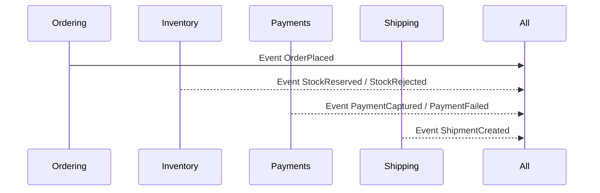
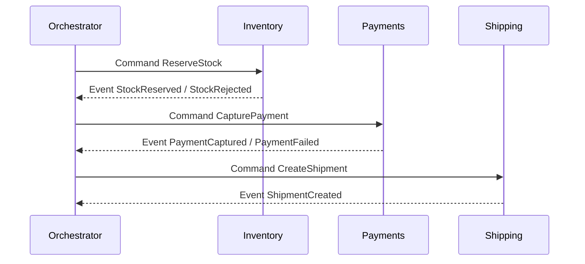

# 🔁 Saga Pattern — Simple Guide (Orchestration vs Choreography)

> **Problem:** One user action touches **many services** (e.g., Order → Inventory → Payment → Shipping). We can’t use one big ACID transaction across them.
> **Saga =** break the big transaction into **small local transactions** + **compensating actions** if something fails.

---

## 🧠 Core idea (in one minute)

- Each service does **its own local transaction** (strongly consistent **inside** the service).
- After each step, the service **publishes an event** or **replies to a command**.
- If a later step fails, we **undo previous steps** with **compensation** (e.g., release stock, refund payment).

> Think “**do step A → do step B → do step C**. If B fails, **undo A**. If C fails, **undo B** (and maybe A).”

---

## 🧭 Two styles of Sagas

### 1) **Choreography** (event-driven, no central brain)

- Services listen to **events** and decide the next step.



- **Flow example:**
  `OrderPlaced` → Inventory reserves stock → emits `StockReserved` → Payments captures → emits `PaymentCaptured` → Shipping ships.
- **If fail:** `StockRejected` → Ordering cancels order (compensation: none).
  `PaymentFailed` → Inventory releases stock (compensation).

**Pros:** Simple to start, highly decoupled.
**Cons:** Flow is “spread out”, harder to see/control; can get messy as steps grow.

---

### 2) **Orchestration** (one lightweight coordinator)

- A small **Orchestrator** (state machine) tells each service what to do (**commands**) and waits for results (**events**).



- **If fail:** Orchestrator sends **compensation commands** (e.g., `ReleaseStock`, `IssueRefund`) and marks the saga as **Failed**.

**Pros:** Clear flow in one place, easier to add timeouts/retries.
**Cons:** One extra service to run (but very small).

---

## 🧾 Compensation (undo actions)

- **Reserve stock** → **Release stock**
- **Capture payment** → **Refund payment**
- **Create shipment** → **Cancel shipment / create return**

> Compensation should be **best-effort** and **idempotent** (safe to run twice).

---

## 🧩 Minimal .NET shapes (just to picture it)

**Choreography – publish/subscribe events:**

```csharp
// Ordering (after saving Order)
await _bus.Publish(new OrderPlaced { OrderId = id, CorrelationId = corr });

// Inventory consumer
public Task Handle(OrderPlaced e) => ReserveStock(e.OrderId); // then publish StockReserved/StockRejected
```

**Orchestration – a tiny coordinator:**

```csharp
// Pseudocode
switch (state)
{
  case Start:
    Send("ReserveStock", orderId); state = WaitingStock; break;

  case WaitingStock when msg == "StockReserved":
    Send("CapturePayment", orderId); state = WaitingPayment; break;

  case WaitingPayment when msg == "PaymentCaptured":
    Send("CreateShipment", orderId); state = WaitingShipment; break;

  case WaitingStock when msg == "StockRejected":
    Send("CancelOrder", orderId); state = Failed; break;

  case WaitingPayment when msg == "PaymentFailed":
    Send("ReleaseStock", orderId);
    Send("CancelOrder", orderId);
    state = Failed; break;

  case WaitingShipment when msg == "ShipmentCreated":
    Publish("OrderCompleted", orderId); state = Completed; break;
}
```

> Use **Outbox** (when saving state) and **Inbox/Idempotency** (when consuming) to avoid lost/duplicate messages.

---

## 🔐 Must-have safeguards (both styles)

- **Idempotency**: same command/event processed twice → same result.
- **Timeouts**: if a step is silent too long → trigger compensation.
- **Retries with backoff** for transient errors; **DLQ** for poison messages.
- **CorrelationId** to tie all events/commands of one saga together.
- **Local constraints** in each service (unique keys, rowversion).

---

## ✅ When to pick which?

- **Few steps, simple flow** → **Choreography** is fine.
- **Many steps, tricky rules, SLAs, timeouts** → **Orchestration** (clear, testable).
- You can **start with choreography**, move to **orchestrator** when complexity grows.

---

## ⚠️ Common mistakes (quick fixes)

| Mistake                                         | Fix                                                              |
| ----------------------------------------------- | ---------------------------------------------------------------- |
| Waiting for all steps before responding to user | Return **202 Accepted** + tracking; update UI as saga progresses |
| No compensation logic                           | Define **explicit undo** for each step                           |
| Relying on global message order                 | Use **per-aggregate keys** + idempotency                         |
| No deduplication                                | **Inbox** table keyed by `(MessageId, Handler)`                  |
| Business logic in gateway                       | Keep saga/orchestration in a **service**, not the edge           |

---

## 📝 5 crisp answers for your assessment

1. **What is a Saga?** A way to finish a multi-service business process using **local transactions + compensations**, not a global ACID transaction.
2. **Orchestration vs Choreography?** Orchestrator **commands** each step vs services **react to events**; orchestration is clearer for complex flows.
3. **How do you undo?** With **compensation** actions (refund, release, cancel), which must be **idempotent**.
4. **How to avoid duplicates/loss?** **Outbox** (publish reliably), **Inbox** (dedupe), **retries + DLQ**.
5. **What about UX?** Return **202** quickly, then show **progress**; data becomes consistent as the saga completes.

---

> **One-liner:** _Sagas break big cross-service transactions into small local ones and use **compensation** to stay correct—use **orchestration** when it gets complex, **choreography** when it’s simple._
